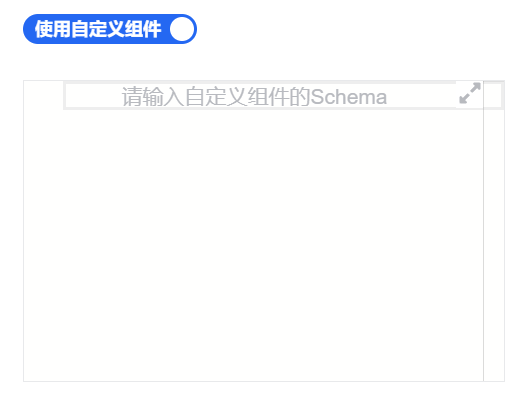
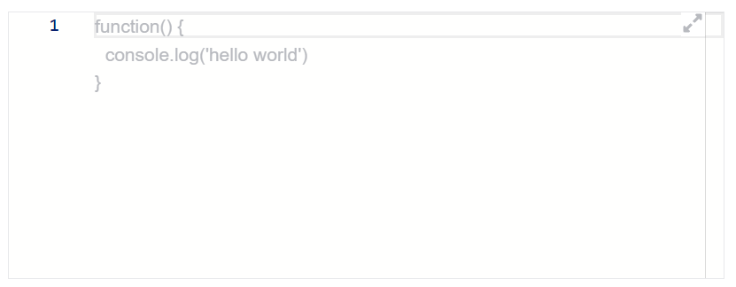

# Schema 与编辑器组件

适用对象：已经确定会继续写 Schema，但想确认平台是否已经内建了动态渲染、预览或代码编辑类组件的开发者。

## 这页适合什么时候看

- 你想动态加载一个已存在的 Schema
- 你想在平台里提供带开关的 Schema 编辑器
- 你想先预览动态渲染出来的 Schema

## 动态渲染 JSON Schema

#### 基本使用

```json
{
  "type": "amis-schema",
  "schemaId": ""
}
```

#### 属性表

| 属性名   | 类型                                                                      | 默认值 | 说明                                                                                                                                |
| -------- | ------------------------------------------------------------------------- | ------ | ----------------------------------------------------------------------------------------------------------------------------------- |
| type     | `string`                                                                  |        | type 指定为 AmisSchema 渲染器                                                                                                       |
| source   | `string` \| [API](https://aisuda.bce.baidu.com/amis/zh-CN/docs/types/api) |        | [ 动态选项组](https://aisuda.bce.baidu.com/amis/zh-CN/components/form/options#%E5%8A%A8%E6%80%81%E9%80%89%E9%A1%B9%E7%BB%84-source) |
| schemaId | `string`                                                                  |        | 已经定义好的 JSON Schema 的标识符,优先级低于`source`属性                                                                            |

## 带开关的代码编辑器

用于实现代码编辑器，支持两种展示形式。

#### 基本使用

```json
{
  "type": "amis-schema-editor",
  "onText": "使用自定义组件",
  "offText": "使用默认组件",
  "placeholder": "请输入自定义组件的Schema",
  "showSwitch": true
},
```

#### 属性表

下列属性为 amis-schema-editor 独占属性,更多属性用法，参考[FormItem 普通表单项](https://aisuda.bce.baidu.com/amis/zh-CN/components/form/formitem#%E5%B1%9E%E6%80%A7%E8%A1%A8)

| 属性名      | 类型                                  | 默认值  | 说明                                         |
| ----------- | ------------------------------------- | ------- | -------------------------------------------- |
| type        | `string`                              |         | type 指定为 AmisSchemaEditor 渲染器          |
| showSwitch  | `boolean`                             | `false` | 展示形式， 详见[showSwitch](#showswitch)     |
| placeholder | `string`                              |         | 代码编辑器占位描述，没有值的时候展示         |
| style       | `object`                              |         | 代码编辑器自定义样式                         |
| className   | `string`                              |         | 代码编辑器外层 Dom 的类名                    |
| onText      | `string` \| [IconSchema](#iconschema) |         | showSwitch 为 true 生效,开启时开关显示的内容 |
| offText     | `string` \| [IconSchema](#iconschema) |         | showSwitch 为 true 生效,关闭时开关显示的内容 |

##### showSwitch {#showswitch}

| 值  | 说明               |
| --- | ------------------ |
| 开  | 增加开关控制       |
| 关  | 常规编辑器形式展示 |

- 以开关的形式展示

  

- 常规编辑器形式展示

  

##### IconSchema {#iconschema}

| 属性名 | 类型     | 默认值 | 说明        |
| ------ | -------- | ------ | ----------- |
| type   | `string` |        | `icon`      |
| icon   | `string` |        | icon 的类型 |

## 预览动态渲染的 JSON Schema

:::warning
和 AmisSchema 组件有什么区别？
:::

#### 基本使用

```json
{
  "type": "amis-schema-preview",
  "schemaId": ""
}
```

#### 属性表

| 属性名   | 类型                                                                      | 默认值 | 说明                                                                                                                                |
| -------- | ------------------------------------------------------------------------- | ------ | ----------------------------------------------------------------------------------------------------------------------------------- |
| type     | `string`                                                                  |        | type 指定为 AmisSchemaPreview 渲染器                                                                                                |
| source   | `string` \| [API](https://aisuda.bce.baidu.com/amis/zh-CN/docs/types/api) |        | [ 动态选项组](https://aisuda.bce.baidu.com/amis/zh-CN/components/form/options#%E5%8A%A8%E6%80%81%E9%80%89%E9%A1%B9%E7%BB%84-source) |
| schemaId | `string`                                                                  |        | 已经定义好的 JSON Schema 的标识符,优先级低于`source`属性                                                                            |
