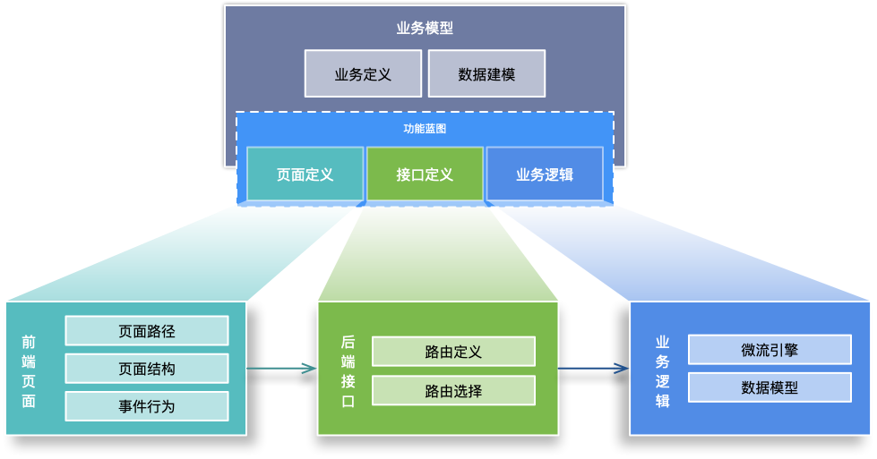

# 业务模型

适用对象：业务开发人员、解决方案设计者、需要把一类业务能力统一沉淀下来的专业开发者。

业务模型是潮汐栈里最接近业务语言的核心抽象。它不是单个数据库表，也不是单个页面，而是一组能够被平台投射为数据、接口、页面、菜单和权限能力的业务定义。

## 它解决什么问题

- 让同一份业务定义同时驱动多处实现，减少重复配置
- 把“实体、操作、页面、接口、权限”放在同一个业务语义下组织
- 让业务开发和融合开发围绕同一个模型协作，而不是各自维护一套描述

## 核心组成

- 基本信息：模型标识、标题、说明、所在模块等
- 业务字段：业务对象的属性定义以及字段约束
- 模型关系：对象之间的关联、引用和组合关系
- 特性配置：列表、详情、流程、导入导出等能力开关
- 视图配置：页面呈现与交互入口
- 接口配置：对外暴露的业务操作
- 访问控制配置：与角色、权限和数据访问范围协同

## 与其他模型的关系

- 业务模型通常会投射出 [数据模型](../data-model/)、[WebAPI 模型](../webapi-model/)、[UI 模型](../ui-model/)、[菜单模型](../menu-model/) 和 [权限模型](../authority-model/)
- 当业务处理过程较复杂时，业务操作往往会进一步接入 [逻辑流模型](../logicflow-model/) 或后端扩展代码
- 当业务过程需要多人、跨时段审批时，通常会配合 [审批流模型](../approval-workflow-model/)

## 典型使用场景

- 定义销售订单、合同、请假单、采购申请等标准业务对象
- 用统一配置生成常见的列表页、表单页、详情页和接口
- 让业务分析、实施和开发人员围绕同一个模型协同迭代

## 阅读建议

- 如果你想学“怎么操作”，先看 [开发业务模型](../../guide/tutorial/business-model/)
- 如果你想理解业务交付主线，先看 [低代码开发总览](../../low-code/overview) 和 [从需求到交付](../../low-code/from-requirement-to-delivery)
- 如果你要做复杂扩展，再看 [融合开发总览](../../fusion-development/overview)
