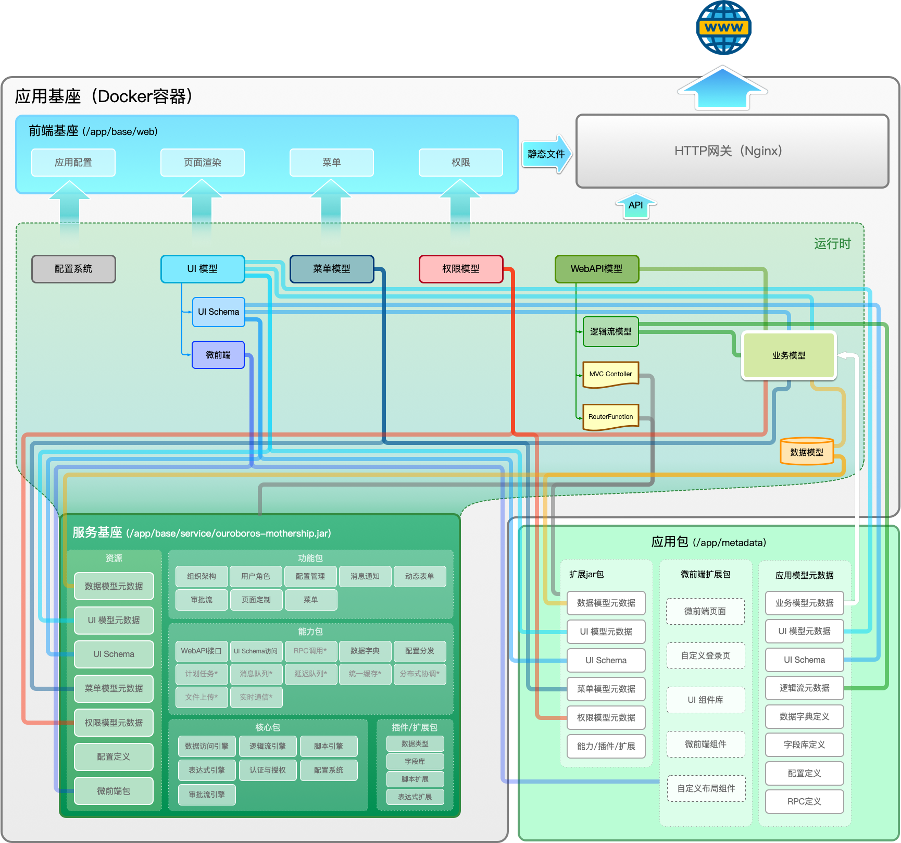

# 核心概念

潮汐栈的 handbook 已经按角色拆成 `快速上手`、`低代码开发`、`融合开发`、`运维管理` 和 `参考资料`。这一栏不再承担“操作步骤”职责，而是解释这些路径背后的平台抽象，帮助你理解平台为什么这样组织能力。

## 什么时候该先看这一栏

- 你需要先建立统一术语，再去看低代码或融合开发的具体操作
- 你正在判断某个需求应该落在模型配置、代码扩展还是运维配置
- 你想理解“业务模型、数据模型、页面、接口、权限、菜单”之间为什么会互相关联
- 你在排查模型投射、覆写、协同关系时，需要一个概念地图

## 概念地图

### 业务与数据

- [业务模型](./business-model/)：最接近业务语言的核心抽象，用来描述一类业务对象及其能力
- [数据模型](./data-model/)：定义数据结构、校验、主键和查询语义
- [字段定义](./field-define/)：把字段类型、校验和展示约定沉淀为可复用规范

### 页面与接口

- [UI 模型](./ui-model/)：定义页面路由、标题和实现方式
- [UI Schema](./ui-schema/)：用声明式 DSL 描述页面结构与交互
- [WebAPI 模型](./webapi-model/)：统一管理 HTTP 接口契约和处理适配方式

### 过程与集成

- [逻辑流模型](./logicflow-model/)：用节点编排机器执行的业务逻辑
- [审批流模型](./approval-workflow-model/)：用流程编排人参与的审批过程
- [RPC 模型](./rpc-model/)：统一描述对外部系统的接口集成

### 治理与装配

- [权限模型](./authority-model/)：定义页面、接口、菜单和数据访问控制
- [菜单模型](./menu-model/)：组织前端导航入口
- [模块模型](./module-model/)：组织应用功能结构，并关联菜单与权限

## 推荐理解顺序

1. 先看 [业务模型](./business-model/) 和 [数据模型](./data-model/)，理解平台怎样承接业务对象。
2. 再看 [UI 模型](./ui-model/)、[UI Schema](./ui-schema/) 和 [WebAPI 模型](./webapi-model/)，理解功能如何暴露给用户与外部系统。
3. 需要处理复杂逻辑时，再看 [逻辑流模型](./logicflow-model/) 和 [审批流模型](./approval-workflow-model/)。
4. 最后看 [权限模型](./authority-model/)、[菜单模型](./menu-model/) 和 [模块模型](./module-model/)，理解应用如何被组织、授权与装配。

## 概念之间最常见的关系

- 业务模型往往会投射出数据、页面、接口、菜单和权限等一组能力。
- UI 模型负责“这个入口是什么”，UI Schema 或微前端负责“这个入口怎么实现”。
- WebAPI 模型负责“这个接口长什么样”，逻辑流或代码扩展负责“这个接口怎么执行”。
- 权限模型、菜单模型和模块模型并不直接承载业务数据，但决定功能如何被组织、暴露和授权。
- 逻辑流模型更偏短事务、机器执行；审批流模型更偏长流程、多人参与。

## 继续阅读

- [低代码开发](../low-code/)：从应用搭建、业务建模到交付
- [融合开发](../fusion-development/)：从扩展点到高低开协同
- [参考资料](../reference/)：查接口、DSL、SDK 和 FAQ
