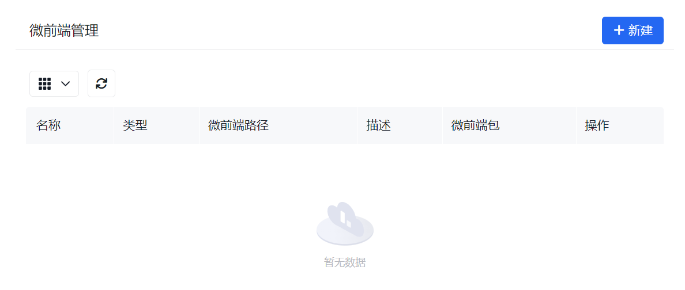
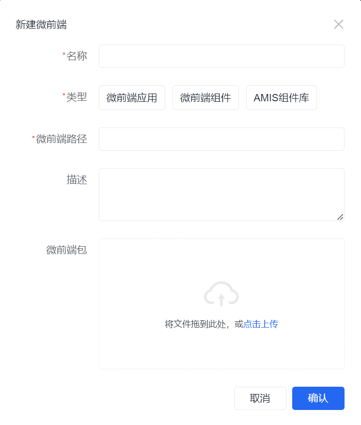
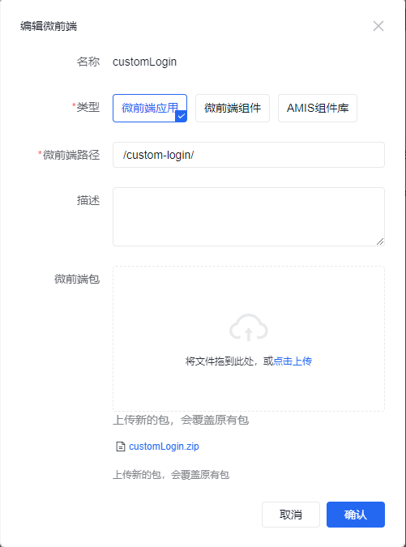

# 扩展前端

潮汐栈的前端基座支持动态加载微前端包。当前文档中的“前端扩展”主要覆盖四类场景：自定义页面、自定义登录页、自定义布局，以及补充低代码页面中的复用组件能力。

如果你是沿着新的手册主线进入这里，建议先对照以下页面：

1. [融合开发总览](../../../fusion-development/overview)
2. [何时用低代码，何时写代码](../../../fusion-development/when-to-use-code)
3. [平台扩展点总表](../../../fusion-development/extension-points)

这页主要作为前端扩展的详细实现总入口；当你已经确认需要通过微前端或组件扩展平台时，再从这里进入具体专题。

如果你当前还在判断“页面、登录页、布局组件、组件库和平台组件库到底该怎么选”，建议先回到 [前端融合开发方式](../../../fusion-development/frontend-extension-paths)。

## 何时进入前端扩展

常见场景包括：

- 标准页面和低代码页面已经不能满足复杂交互需求
- 需要用独立前端工程承接成组页面或专门的登录体验
- 需要替换顶栏、侧栏等平台级布局
- 需要把某些前端控件沉淀成可复用组件

如果需求仍然属于标准表单、列表、流程页面的配置级定制，通常优先留在低代码路径中完成。

## 建议阅读顺序

1. [融合开发总览](../../../fusion-development/overview)
2. [何时用低代码，何时写代码](../../../fusion-development/when-to-use-code)
3. [前端融合开发方式](../../../fusion-development/frontend-extension-paths)
4. [微前端应用](./micro-app/)
5. 按需要进入 [布局组件](./layout-component/) 或 [组件库](./amis-component/)

## 如何选择扩展方式

- 微前端应用：承接完整页面、复杂交互或自定义登录页
- 布局组件：替换顶栏、侧栏等平台级框架组件
- 组件库：给低代码页面补充新的可复用前端组件

手册里统一把这条路线称为“组件库”。当前管理界面里仍然会看到“AMIS 组件库”这个类型名；这是当前产品实现中的管理分类名称。

同理，管理界面里的“微前端组件”主要对应这里说的“布局组件”。

## 配置方式 {#configuration}

### 微前端管理


这个页面是前端扩展包的统一管理入口，可以在这里创建、修改、删除微前端记录并上传 zip 包。

### 创建微前端

1. 在“高级 -> 微前端”中点击`新建`。
2. 填写基本信息并上传构建产物。
   
   | 属性 | 必填 | 说明 |
   | ---------- | ---- | ------------------------------------------------------------------ |
   | 名称 | 是 | 微前端名称，建议使用稳定且可识别的英文标识 |
   | 类型 | 是 | [微前端类型](#微前端类型) |
   | 微前端路径 | 是 | 微前端静态资源的基础路径，即构建产物中的 `publicPath`，[查看例子](#微前端路径) |
   | 描述 | 否 | 微前端描述信息 |
   | 微前端包 | 否 | 打包后的微前端 zip 包 |

   :::warning
   zip 包不能用苹果系统自带的压缩工具。
   :::

#### 微前端类型

- 微前端应用：适合于构建自定义页面或自定义登录页，[查看具体实现流程](./micro-app/)。
- 微前端组件：管理界面的类型名，主要用于接入[布局组件](./layout-component/)。
- AMIS 组件库：管理界面的当前类型名，对应手册里的[组件库](./amis-component/)，主要用于给低代码页面补充可复用组件能力。

#### 微前端路径

以自定义登录页举例说明，若**Vue 项目中的 Webpack 配置 publicPath**

```js
const packageName = require('./package.json').name

module.exports = {
  publicPath: '/custom-login/',
  // 其他配置不在此说明,
}
```

则在上方表单中配置微前端路径为`/custom-login/`, 如下图：



### 编辑微前端

- 在列表中点击`编辑`即可更新描述、路径或上传新包。
- 名称通常作为稳定标识使用，创建后不建议再改；上传新包会覆盖原有产物。

### 删除微前端

- 在列表中点击`删除`即可移除该记录。
- 删除前先检查它是否已经被登录页、布局或业务页面引用。
