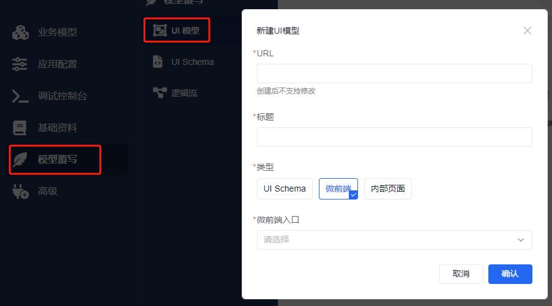
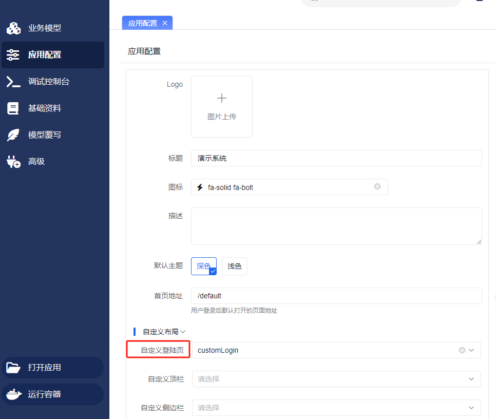

# 微前端应用

潮汐栈支持使用微前端应用来自定义页面或自定义登录页。微前端应用可以是多路由的复杂应用，也可以是单一组件的页面，能够根据需求灵活定制不同类型的应用和页面。

如果你是沿着新的手册主线进入这里，建议先对照以下页面：

1. [融合开发总览](../../../../fusion-development/overview)
2. [平台扩展点总表](../../../../fusion-development/extension-points)
3. [应用改造](../application-transformation)

这页主要用于查“如何用微前端覆盖页面或登录页”的实现路径；当你已经确认要通过微前端扩展平台时，再回来读会更顺。

## 自定义页面

### 多路由复杂应用

**实现步骤**

1. 构建应用 - 自选前端技术，创建应用。
2. [应用改造](../application-transformation)。
3. 打包，新增微前端。

- 构建应用程序，并将其打包成 zip 文件。
- 通过平台的 `高级 -> 微前端` 菜单新增微前端，类型选择为**微前端应用**，[点击查看具体配置方式](../index.md#configuration)。

4. 创建[业务模型](../../../tutorial/business-model/)。
5. 在业务模型中通过 UI 模型覆盖当前页面。
   

| 参数名     | 说明                 |
| ---------- | -------------------- |
| URL        | 要覆盖的页面的地址   |
| 标题       | 菜单标题             |
| 类型       | 类型选择**微前端**   |
| 微前端入口 | 选择已经上传的微前端 |

### 单组件应用

:::warning
单组件应用应避免注入路由。
:::

**实现步骤**

1. 构建应用 - 自选前端技术，创建应用。
2. [应用改造](../application-transformation)。
3. 打包，新增微前端

- 构建应用程序，并将其打包成 zip 文件。
- 通过平台的 `高级 -> 微前端` 菜单新增微前端，类型选择为**微前端应用**，[点击查看具体配置方式](../index.md#configuration)。

4. 创建[业务模型](../../../tutorial/business-model/)。
5. 模型覆盖，加载微前端应用来覆盖当前的页面，组件类型支持[表单内加载微前端](../../../../api/frontend/buildin-comps/business-pickers-and-micro-components#表单内加载微前端应用)或[加载微前端](../../../../api/frontend/buildin-comps/business-pickers-and-micro-components#加载微前端应用)，按需选择。

**加载微前端示例**

```json
{
  "type": "page",
  "body": [
    {
      "type": "micro-component",
      "entry": "已经上传的微前端路径"
    }
  ]
}
```

## 自定义登录页

潮汐栈支持通过微前端替换默认 `/login` 页面，从而完全自定义登录页的视觉和交互。

### 推荐阅读

自定义登录页已整理为统一文档，请直接阅读：

- [平台自定义登录页集成指南](./custom-login-integration)

该指南统一包含：

- 本地登录、LDAP 登录、CAS/OAuth2/OIDC 跳转登录的组织方式
- `props` / `ouroboros-sdk` 中可用的认证能力
- `token` 快照与 `getToken()` 最新值的区别
- 登录页 i18n namespace、推荐 key 与语言切换方式
- 打包上传和平台配置方式

### 简要步骤

1. 构建自定义登录页微前端，优先使用单组件模式。
2. 完成 [应用改造](../application-transformation)。
3. 参考 [平台自定义登录页集成指南](./custom-login-integration) 完成登录、LDAP、SSO 和 i18n 接入。
4. 在“高级 -> 微前端”中上传 zip 包，并在“应用配置”中将其配置为登录页入口。



## 使用建议

- 如果只是替换单个页面或登录页，优先选择单组件模式，通常更轻量
- 如果需要承接一整组页面和路由，再选择多路由复杂应用
- 开始接平台前，先把 `publicPath`、打包产物和平台入口路径对齐，能少掉很多接入问题
