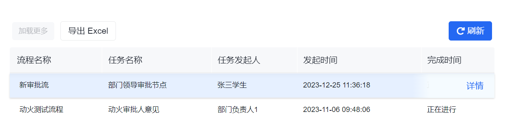
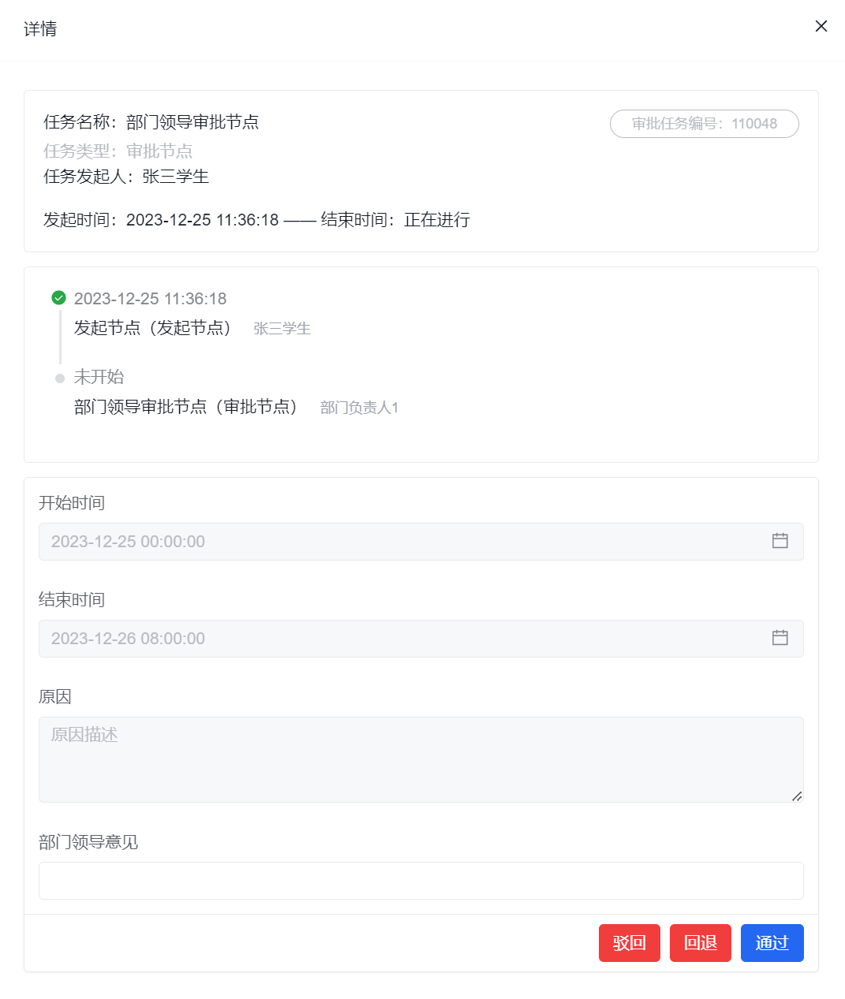

# 审批中心

审批中心是审批人员查看、处理待办流程的入口。

如果你要查看流程定义，请回到 [审批流管理](../approval-management/)。如果你要看整体数据，请继续到 [审批流统计](../approval-statistics/)。

## 页面概览

## 常见任务

### 处理待办列表

列表页通常支持加载更多、导出 Excel 和进入审批详情。

### 查看并审批

进入详情后，审批人员通常可以查看申请信息、审批时间线，并根据流程定义执行批准、拒绝或退回等动作。

示例如下：

:::info
审批按钮是否显示，取决于流程定义中[审批配置](../approval-management/#审批配置)允许的审批动作。
:::

## 使用建议

- 如果列表里看不到预期待办，先检查流程是否真的流转到了当前审批人
- 如果详情页只有查看权限而没有审批动作，优先回到流程定义确认审批配置和当前节点状态
