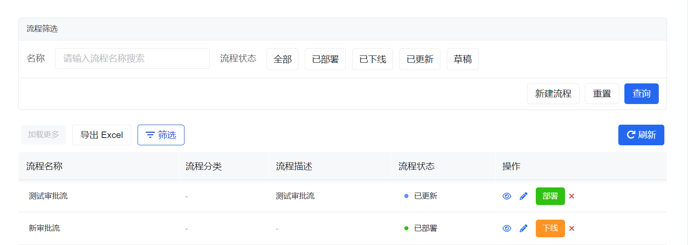
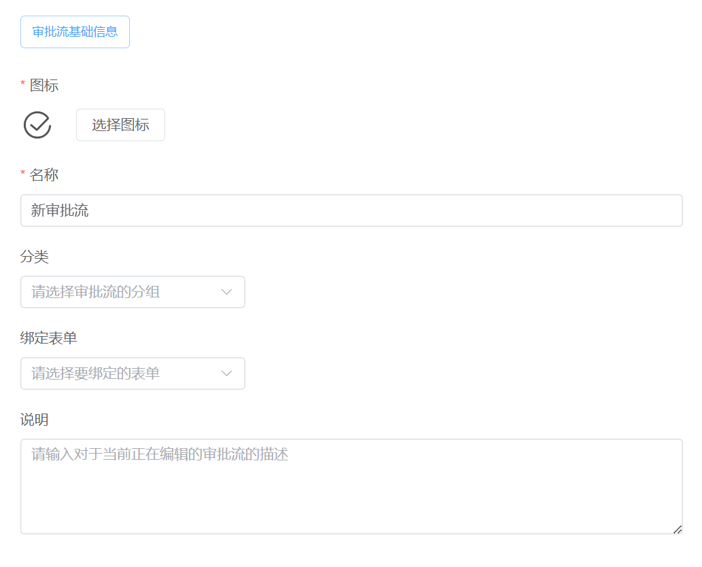
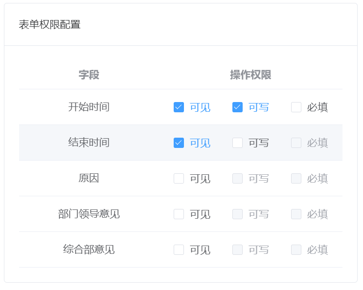
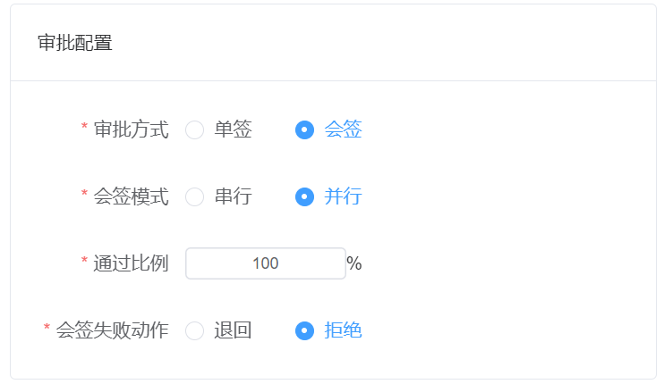
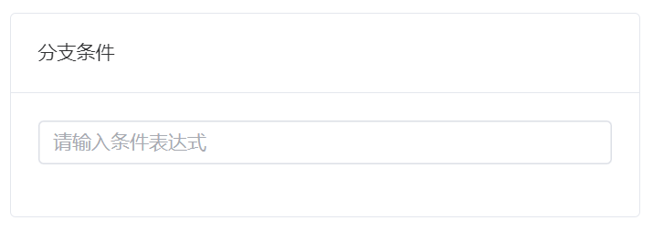

# 审批流管理

审批流管理用于定义、编辑、部署和下线审批流程，是审批能力的设计入口。

如果你在找“业务人员如何提交审批”，请转到 [发起审批](../approval-start/)。如果你在找“审批人如何处理任务”，请转到 [审批中心](../approval-center/)。

在开始设计前，建议先确认组织架构、角色和绑定表单已经准备好，否则后面的人员配置和表单权限配置会反复调整。

## 这页适合什么时候读

- 你已经确认要做审批闭环，准备开始设计流程定义
- 你已经有业务表单，但还不确定审批节点、候选人和字段权限怎么配置
- 你在排查“流程改了为什么没生效”或“为什么审批人不是预期的人”

## 先理解这页和其他审批页面的分工

审批流相关页面可以这样分工理解：

- 审批流管理：定义流程怎么设计、谁来审批、字段怎么控制
- [发起审批](../approval-start/)：业务人员从哪里发起流程
- [审批中心](../approval-center/)：审批人在哪里处理任务

也就是说，这页更偏“设计时入口”，不是“运行时处理入口”。

## 开始前最好先准备好三类东西

1. 组织数据：至少要有员工、部门，必要时再加角色
2. 业务表单：审批需要绑定表单，字段权限也依赖表单字段
3. 流程边界：先想清楚谁发起、谁审批、什么情况下分支、通过后去哪里

如果这三件事还没准备好，就直接开始画流程，后面通常会在候选人、表单权限和条件分支上来回返工。

## 页面概览

## 流程状态

| 当前状态 | 转移状态 | 状态转移描述                         |
| -------- | -------- | ------------------------------------ |
| 草稿     | 已更新   | 编辑草稿状态的审批流并保存后状态变更 |
| 草稿     | 已部署   | 部署草稿流程后状态变更               |
| 已更新   | 已部署   | 重新部署后状态变更                   |
| 已部署   | 已下线   | 下线后状态变更                       |
| 已部署   | 已更新   | 重新编辑已部署流程并保存后状态变更   |
| 已下线   | 已部署   | 重新部署后状态变更                   |

:::info
审批流从 **已部署** 变成 **已更新** 后，需要重新部署，新的流程定义才会对 [发起审批](../approval-start/) 生效。
:::

## 常见任务

### 维护审批流列表

列表页通常用于做这几件事：

- 按关键字或状态查找流程
- 查看当前流程是草稿、已部署还是已下线
- 进入编辑、预览、部署、下线或删除

如果你是第一次搭审批，建议先只关注“名称、状态、最近修改结果”这几个关键信息，不要一开始就同时维护很多流程。

### 新建审批流程

新建流程时，通常要同时完成两部分：基本信息和流程设计。

#### 基本信息

| 属性     | 必填 | 说明                                                                 |
| -------- | ---- | -------------------------------------------------------------------- |
| 图标     | 是   | 流程在发起入口和管理列表中的展示图标，便于业务识别                   |
| 名称     | 是   | 审批流程名称，例如“请假审批”“付款申请”“合同评审”                   |
| 分类     | 否   | 用于把流程按业务类型分组，便于发起和管理时筛选                       |
| 绑定表单 | 否   | 关联流程所使用的业务表单；审批节点的字段权限通常也基于这个表单配置   |
| 说明     | 否   | 对流程适用范围、注意事项或业务背景的补充说明                         |

这里最关键的不是把信息填全，而是先确认“这是不是一个独立流程”。如果一个流程里塞入太多业务变体，后面条件分支会迅速失控。

#### 流程设计

流程设计采用可视化编辑器，核心不是把图画复杂，而是把以下四件事讲清楚：

1. 从哪发起
2. 谁来审批
3. 哪些字段在每一步可见、可改、必填
4. 审批不通过或条件不满足时往哪里走

| 节点类型   | 节点配置                                                                    |
| ---------- | --------------------------------------------------------------------------- |
| 发起节点   | [表单权限配置](#表单权限配置)                                               |
| 审批节点   | [人员配置](#人员配置)、[审批配置](#审批配置)、[表单权限配置](#表单权限配置) |
| 定时器节点 | [定时器配置](#定时器配置)                                                   |
| 条件节点   | [分支条件](#分支条件)                                                       |

实践上，第一次建流程时建议先只做“发起 -> 审批 -> 结束”的最小链路，跑通后再逐步补条件分支和更复杂的审批策略。

##### 表单权限配置

用于控制不同节点上字段的可见、可写和必填。

###### 名称解释

- 可见：谁可以在表单中看到该字段
- 可写：谁有权限修改和编辑该字段的值
- 必填：填写表单时必须填写的字段

###### 三种操作权限关系

- 勾选 `可见` 后，才可能进一步开放 `可写`
- 勾选 `可写` 后，才可能进一步开放 `必填`

实际设计时，可以把它理解成“每一步允许业务方补哪些内容”。

常见设计习惯如下：

- 发起节点：开放大部分业务字段填写
- 中间审批节点：只开放审批意见、补充说明等少数字段
- 财务 / 复核节点：只开放本节点真正需要补的数据

字段权限如果一开始不收紧，审批过程中很容易出现“后面节点把前面关键数据又改掉”的问题。

##### 人员配置

| 配置方式   | 说明                                     |
| ---------- | ---------------------------------------- |
| 员工       | 从组织架构选择具体员工审批               |
| 角色       | 选择角色审批                             |
| 用户自选   | 发起人从组织架构中自选员工审批           |
| 流程发起人 | 流程的发起人也可以是审批人，实现自我审批 |

:::warning
多种配置方式，目前只能选一种。
:::

当前运行时里，页面主流暴露的候选人方式主要是：员工、角色、用户自选、流程发起人。

选择建议可以这样把握：

- 员工：审批人就是很明确的具体人
- 角色：适合某类职责固定，但具体人会变动的场景
- 用户自选：适合发起时才能确定审批人的场景
- 流程发起人：适合需要本人确认、补充或回看节点的场景

如果你发现审批人经常变化，优先考虑角色而不是硬编码员工；这样后续组织调整时不需要反复改流程。

##### 审批配置

审批节点既可以是单签，也可以是会签。

- 单签：只需要一个审批人给出结论
- 退回：退回到上一级审批环节；如果上一级已经是发起节点，通常等同于拒绝
- 拒绝：直接终止当前申请，不再继续流转

###### 会签名称解释

- 会签：需要多个审批人共同参与审批
- 串行：审批请求依次发送给审批人，前一个审批人完成后才会流转到下一个
- 并行：同时发送给所有审批人，每个参与者独立处理
- 通过比例：审批通过人数达到设定比例后，流程进入下一步
- 退回：将流程退回到上一级审批环节
- 拒绝：直接终止当前申请

会签常见理解方式如下：

1. 设置审批人有用户 1、用户 2、用户 3，设置会签模式为**串行**，通过比例设为**50%**，当用户 1 审批通过后，流转到用户 2 审批；用户 2 审批通过后，当前审批请求结束，进入下一个审批流程。
2. 设置审批人有用户 1、用户 2、用户 3，设置会签模式为**并行**，通过比例设为**50%**，当用户 1、用户 2、用户 3 **同时**收到审批消息；用户 1 和用户 3 审批同意后，进入下一个审批流程。

:::warning
会签模式下，人员配置中**流程发起人**隐藏。
:::

什么时候用单签，什么时候用会签，可以这样快速判断：

- 单签：只要一个人给出结论即可，例如直属主管审批
- 会签：必须多人共同参与，例如合同评审、跨部门会审

第一次设计流程时，除非业务明确要求多人共同审批，否则优先从单签开始。会签虽然灵活，但更容易在候选人为空、通过比例和退回路径上出错。

##### 定时器配置

定时器节点适合把审批触发放到某个固定时间点或延迟时间点，而不是由业务人员手工发起。

如果你的业务本质上是“人提交，人审批”，通常不需要一开始就引入定时器；先把手工发起链路跑通更稳。

##### 分支条件

条件节点用来根据表单数据、金额、类型、申请人属性等条件决定流程走向。

常见例子：

- 金额小于某阈值走单主管审批
- 金额超过阈值再增加财务或高层审批
- 不同申请类型走不同后续分支

条件越多，越要注意命名和描述，不然后面维护的人很难快速理解“为什么流程会走这条路”。

### 查看和编辑审批流

查看和编辑审批流时，页面结构与新建流程基本一致，只是当前流程已经有现成定义可供调整。

:::info
如果保存后列表页没有立即反映最新状态，可以手动刷新列表重新加载。
:::

要特别注意：编辑并保存，不等于立即上线。只要流程状态变成“已更新”，就还需要重新部署，新的定义才会被发起入口真正使用。

### 部署、下线与删除

- 部署：让当前流程定义对业务发起真正生效
- 下线：停止使用当前已部署流程
- 删除：移除草稿流程

状态决定了这些动作是否可见：只有已部署流程才能下线，只有草稿流程才能删除。

这里最容易踩的坑是“我已经保存了，为什么业务还在走旧流程”。通常答案就是：你保存了，但还没有重新部署。

删除前也建议先确认该流程是否已经被业务使用；即使页面允许删除草稿，也不要把仍在设计中的重要版本随手删掉。

## 常见误区

### 一开始就把所有分支都画进去

这会让流程很快变得难以理解，也更难排查。

更稳的做法是先做一个最小可运行版本，再按真实业务逐步补复杂分支。

### 用具体员工代替角色

如果某个审批职责本质上跟岗位或角色绑定，而不是永远固定到某个人，直接配员工往往会让后续维护成本很高。

### 修改后只保存，不重新部署

这是审批流最常见的问题之一。只要是面向业务运行的改动，就要把“保存”和“部署”当成两步看待。

## 使用建议

- 第一次设计流程时，先做一个节点少、分支少的最小版本
- 优先先把候选人策略和字段权限想清楚，再去堆复杂分支
- 每次修改已部署流程后，记得重新部署，再让业务人员发起验证
- 如果你当前是在排查“为什么发不起审批”或“为什么审批人不对”，可以对照 [发起审批](../approval-start/) 和 [审批中心](../approval-center/) 一起检查

## 下一步看哪里

- 想看业务人员如何真正发起：看 [发起审批](../approval-start/)
- 想看审批人如何处理任务：看 [审批中心](../approval-center/)
- 想先把组织、角色和候选人准备好：看 [组织架构管理](../../organization/) 和 [用户角色权限](../../rbac/)
