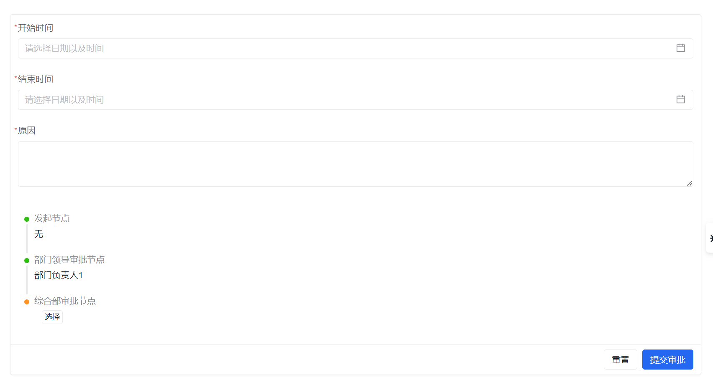

# 发起审批

发起审批是业务申请人提交审批请求的入口。

在开始前，建议先确认：

- 对应审批流已经处于可发起状态
- 当前用户具备发起权限
- 关联表单和审批人配置已经准备好

## 页面概览

按照流程分类展示发起审批流。

:::info
如果发起审批页面已经打开，而审批流定义刚刚被调整过，建议手动刷新页面，同步最新流程定义。
:::

## 常见任务

### 查看流程基本信息

如果你不确定某个流程适不适合当前业务，可以先查看它的基本说明。

### 提交审批申请

发起时通常会经历这几个动作：

1. 选择一个可发起的审批流。
2. 按绑定表单填写申请信息。
3. 如果流程支持“用户自选”审批人，在时间线或审批链位置补齐审批人。
4. 提交审批。

示例如下：

:::info
当流程定义中的[人员配置](../approval-management/#人员配置)为“用户自选”时，页面才会出现 `选择` 按钮；其他情况下会直接显示审批人。
:::

## 使用建议

- 先确认当前审批流绑定的表单和审批链是否已经发布，再开始提交流程
- 第一次联调时，建议用一个简单场景先验证“发起成功、审批人能收到待办、审批后能流转”
