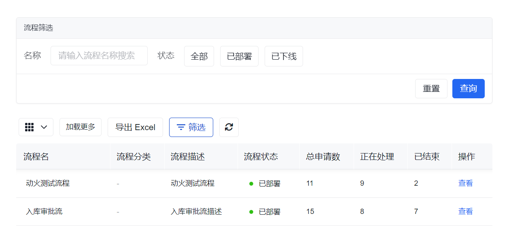
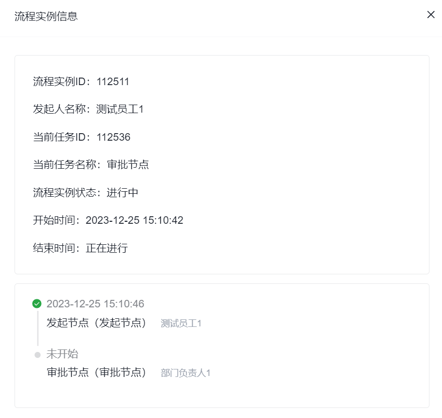

# 审批流统计

审批流统计用于从管理视角查看流程执行情况、审批实例和异常终止情况。

适合：

- 关注审批效率和执行量的管理人员
- 需要定位具体实例问题的运维或业务支持人员

## 页面概览

## 常见任务

### 查看流程统计列表

统计列表页通常支持加载更多、导出 Excel，以及进入某条流程的实例明细。

### 查看流程执行明细

进入某个流程后，可以查看该流程的所有申请实例；明细列表的数据通常与该流程的**总申请数**对应。

流程执行明细示例如下：

当前页面还包含以下功能：

#### 加载更多与导出 Excel

实例明细列表同样通常支持继续加载和导出。

#### 查看实例详情

进入实例详情后，可以看到当前申请的基本信息和审批时间线。

流程执行详情示例如下：

#### 强制结束

:::warning
强制结束会直接中断当前流程实例，通常更适合在异常处理、测试清理或管理介入场景下使用；正式业务场景中建议先确认影响范围。
:::
