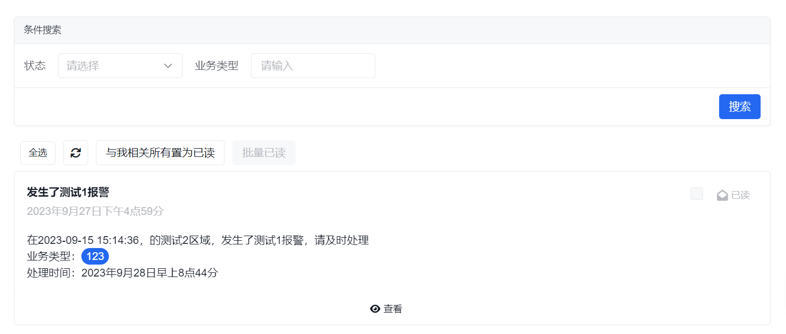
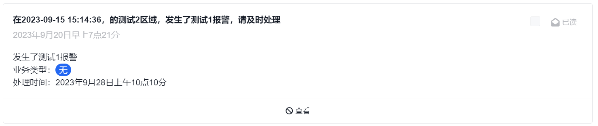

# 消息通知

消息通知模块主要用于查看和处理已经发送到站内信收件箱里的消息。

如果你是沿着新的手册主线进入这里，建议先对照以下页面：

1. [低代码开发总览](../../../low-code/overview)
2. [组织、权限、配置与通知](../../../low-code/organization-permissions-configuration-and-notification)
3. [消息通知模板与渠道配置](../../tutorial/notification/)

这页主要讲“消息到了以后，用户如何在平台里查看和处理”；如果你当前要解决的是“消息怎么发出去、发给谁、走什么渠道”，应优先看通知模板和组织配置相关页面。

## 先理解这页的边界

这一页容易和“通知模板”“短信/邮件/企业协同渠道配置”混在一起，但它们并不是同一层能力：

- 这页关注的是消息中心，也就是用户收到了什么站内消息、能如何处理
- [消息通知模板与渠道配置](../../tutorial/notification/) 关注的是消息怎么定义、怎么拼内容、通过什么渠道发送
- [组织、权限、配置与通知](../../../low-code/organization-permissions-configuration-and-notification) 关注的是通知触达人、组织关系和业务配置如何一起协同

换句话说，通知模板解决“发什么”，渠道接入解决“怎么发”，而这页解决“发到站内信以后用户怎么看、怎么处理”。

## 你通常会在这里完成什么

- 查看站内信收件箱里的未读或已读消息
- 批量把消息置为已读
- 通过消息动作跳转到对应业务页面
- 快速判断某条消息是否已经成功触达到站内信收件箱

## 页面概览

通常情况下，这里展示的是已经发送成功并进入站内信渠道的消息记录。若你在这里看不到消息，不一定是页面问题，也可能是上游模板、接收人或渠道条件没有满足。

## 常见任务

### 全选

先批量选中消息，再执行后续操作，适合统一处理一批待清理的提醒。

### 与我相关所有置为已读

适合快速清空当前用户相关的未读站内信，不需要逐条处理。

### 批量已读

适合按当前筛选结果批量处理消息。若你已经按类型、关键字或状态筛过一轮，这个动作会更高效。

### 查看

如果站内信模板里配置了可选项**动作**，`查看`通常会跳转到对应业务页面；如果未配置，该按钮会不可点击。

### 单条消息置为已读

适合处理单条消息，不影响其他未读记录。

## 常见判断

### 页面里没有看到预期消息

优先按下面顺序排查：

1. 先确认业务流程是否真的触发了发送通知
2. 再确认通知模板里是否启用了站内信渠道
3. 再确认接收人是否正确解析到员工或用户
4. 最后再回到这页确认是否只是筛选条件导致消息没显示出来

### `查看` 按钮不可点击

这通常不是消息中心页面本身的问题，而是通知模板里没有配置站内信动作，或者动作配置没有生成有效跳转地址。

### 消息已读了，但业务还没处理

“已读”只表示用户在消息中心里看过这条消息，不表示对应业务已经完成处理。真正的业务状态仍要回到原始业务页面、待办或审批流里确认。

## 下一步看哪里

- 想配置通知模板、载荷参数和多渠道发送：看 [消息通知模板与渠道配置](../../tutorial/notification/)
- 想理解通知和组织、权限、配置为什么要一起规划：看 [组织、权限、配置与通知](../../../low-code/organization-permissions-configuration-and-notification)
- 想继续看审批场景里的消息触达：看 [审批流](../approval-workflow/)
