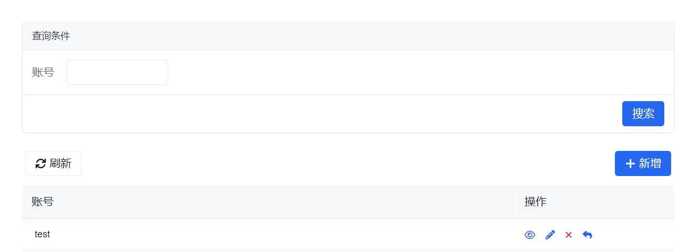

# 用户角色权限

用户角色权限模块用于维护账号、角色以及角色与用户的关系，是页面访问、接口访问和数据权限治理的基础入口。

如果你是沿着新的手册主线进入这里，建议先对照以下页面：

1. [低代码开发总览](../../../low-code/overview)
2. [权限模型](../../../concepts/authority-model/)
3. [组织架构管理](../organization/)

这页主要用于账号、角色和权限配置；如果你当前目标是把一个业务功能真正交付出去，也建议同时回看 [从需求到交付](../../../low-code/from-requirement-to-delivery) 中的权限补齐阶段。

## 先理解这页的边界

这页容易和“组织架构管理”混在一起，但它们处理的不是同一件事：

- 组织架构：维护员工、部门、岗位这些业务身份关系
- 用户角色权限：维护登录账号、角色、权限和数据访问范围

更具体地说：

- 用户：回答“谁能登录系统”
- 角色：回答“登录后拥有什么权限集合”
- 员工关联：通常回答“这个账号在业务里对应谁”，这一步很多时候在 [组织架构管理](../organization/) 中完成

所以，如果你只是想给一个人开通登录账号和菜单权限，优先看这页；如果你还要让这个账号在审批、通知、组织上下文里被识别成某个员工，就要结合组织架构页一起处理。

## 你通常会在这里完成什么

- 创建或维护系统用户
- 创建业务角色
- 把角色分配给用户
- 为角色配置功能权限和数据权限

## 页面概览

### 用户管理界面

### 角色管理界面

## 常见任务

### 维护用户

用户是系统登录账号，不等于员工档案本身。当前新增用户时，页面主要会要求你填写账号、角色和密码。

| 属性 | 必填 | 说明                                                                 |
| ---- | ---- | -------------------------------------------------------------------- |
| 账号 | 是   | 登录系统使用的唯一账号标识                                           |
| 角色 | 否   | 用户创建时可直接分配一组角色，便于一次性完成初始权限配置             |
| 密码 | 是   | 当前默认页面要求输入初始密码，并校验复杂度                           |

实际使用时有两个值得注意的点：

- 当前新增页里就可以直接分配角色，不必一定等到创建后再编辑
- 密码通常需要满足复杂度规则，正式环境中建议统一密码策略和重置流程

### 查看或编辑用户

当前默认页面里，用户编辑入口主要是“编辑角色”，也就是调整账号关联的角色集合，而不是修改账号名本身。

查看用户详情时，通常会看到：

- 账号
- 当前关联角色

如果你需要调整“这个账号在业务里对应哪个员工”，通常不在这页完成，而是在 [组织架构管理](../organization/) 的员工详情里做用户关联。

### 删除或重置用户

用户管理页通常会提供删除和重置密码动作，适合处理账号生命周期问题。

使用上建议注意：

- 删除账号前，先确认它是否仍被业务人员使用
- 重置密码通常是管理员动作，不建议把它当作日常用户自助流程
- 如果只是角色不对，优先先改角色，而不是删号重建

### 维护角色

角色用来沉淀一类职责对应的权限集合，例如“销售经理”“财务审核”“系统管理员”。

| 属性     | 必填 | 说明                         |
| -------- | ---- | ---------------------------- |
| 角色名称 | 是   | 角色在系统中的显示名称       |

角色名称通常可以在角色管理中快速修改：

如果一个角色对应的是长期稳定的职责，而不是某个临时人员，优先用角色沉淀权限会比直接给具体账号逐个配权限更稳。

### 编辑角色权限

角色权限一般包括两部分：

- 功能权限：决定页面、菜单、接口或动作能不能用
- 数据权限：决定在可访问的前提下，能看哪些数据、按什么范围看

当前页面通常会把权限展示成树形结构，你可以在这里为角色勾选权限项，并在支持的场景下继续配置数据权限参数。

:::info
“配置数据权限”按钮的显示与可操作范围，通常取决于当前权限定义是否声明了访问控制参数；若界面与截图不完全一致，请以当前产品配置为准。
:::

### 区分可控角色和平台内置角色

当前角色管理页面里，并不是所有角色都一定能被直接编辑。

一些角色可能是平台内置或由系统提供的，这类角色通常更适合查看而不是修改；而业务自行维护的角色，才适合在页面中继续编辑权限和名称。

如果你发现某个角色只能看不能改，通常不是页面问题，而是这个角色本身不属于“可控角色”。

### 维护角色与用户关系

如果你更习惯从角色视角来做配置，也可以在角色管理里批量选择该角色关联的用户。

这适合下面几类场景：

- 某个新角色刚建好，需要一次性分给一批现有账号
- 想从“职责”出发核对谁属于这个角色
- 想快速清理某个角色下的用户列表

从用户页维护角色，和从角色页维护用户，本质上都是在维护同一组用户角色关系；选择你更顺手的入口即可。

## 常见误区

### 把用户当成员工

用户只是登录账号，员工是业务身份。两者经常一一对应，但并不是同一张表、同一件事。

### 给每个用户单独想权限，不先抽角色

这样短期看似快，长期会很难维护。只要多人拥有相似职责，就应该优先沉淀成角色。

### 只配菜单权限，不看数据权限

很多“看得到页面但看不到数据”或“能进页面却操作不了数据”的问题，本质上不是菜单权限没配，而是数据权限没补全。

## 使用建议

- 先完成组织架构和用户准备，再批量配置角色关系会更顺手
- 先梳理“谁能看见什么、谁能执行什么”，再落到角色权限配置
- 如果你需要让账号在业务里对应到具体员工，记得回到 [组织架构管理](../organization/) 补用户关联
- 如果你需要先理解权限边界，而不是立刻操作页面，建议回看 [权限模型](../../../concepts/authority-model/)

## 下一步看哪里

- 想继续补组织和员工身份：看 [组织架构管理](../organization/)
- 想先理解权限抽象，而不是继续点页面：看 [权限模型](../../../concepts/authority-model/)
- 想继续看更底层的权限与访问控制实现：看 [权限与访问控制](../../advance/authority-and-access-control)
