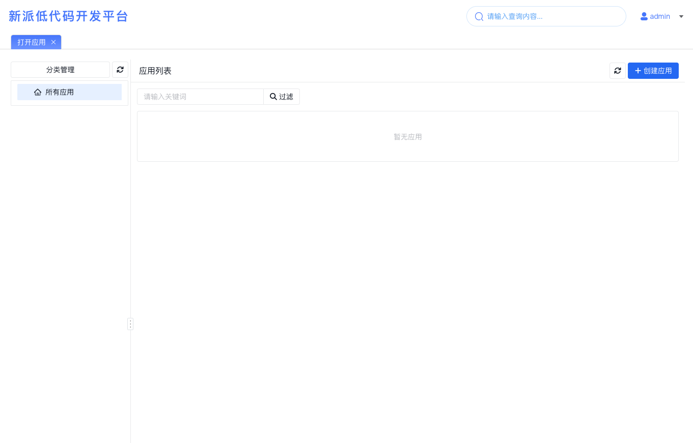
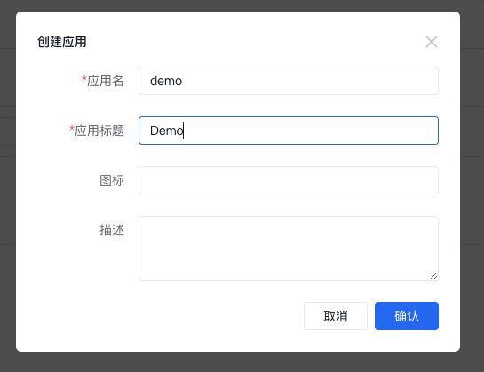
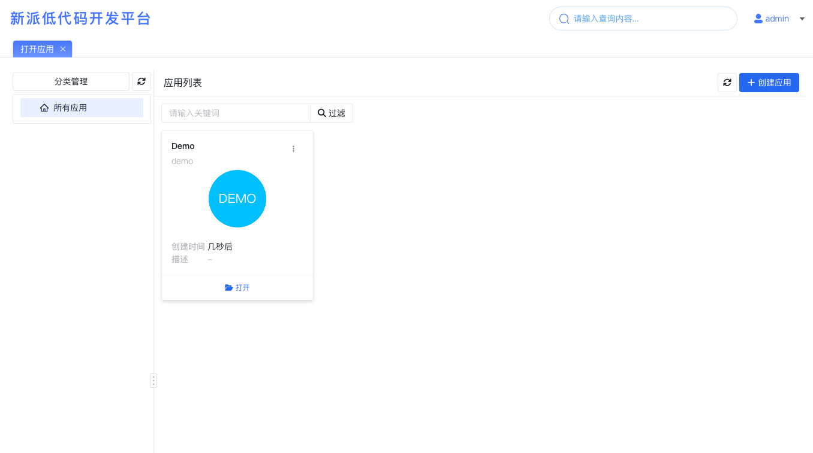
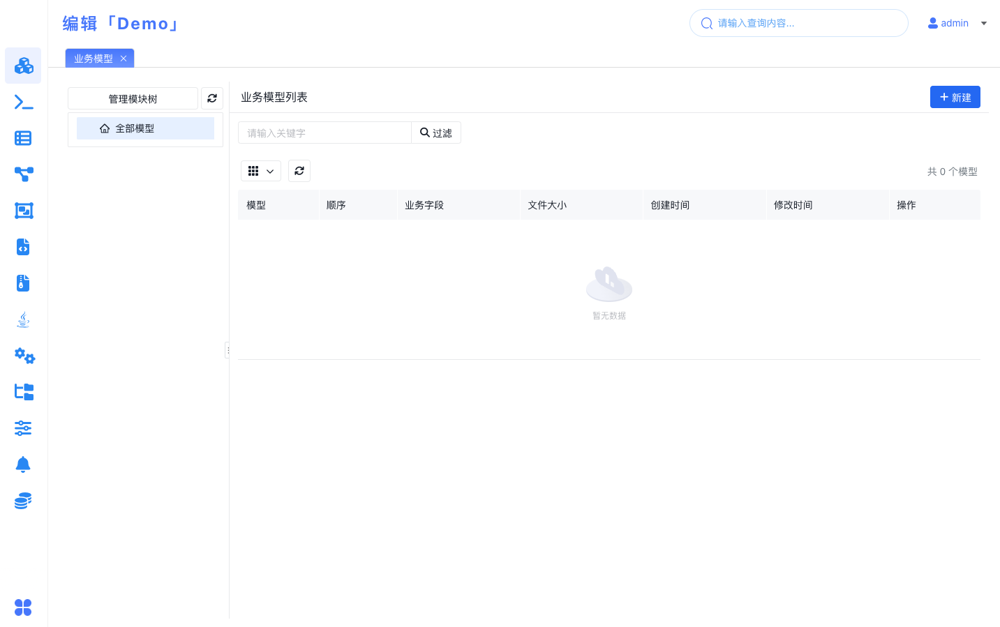
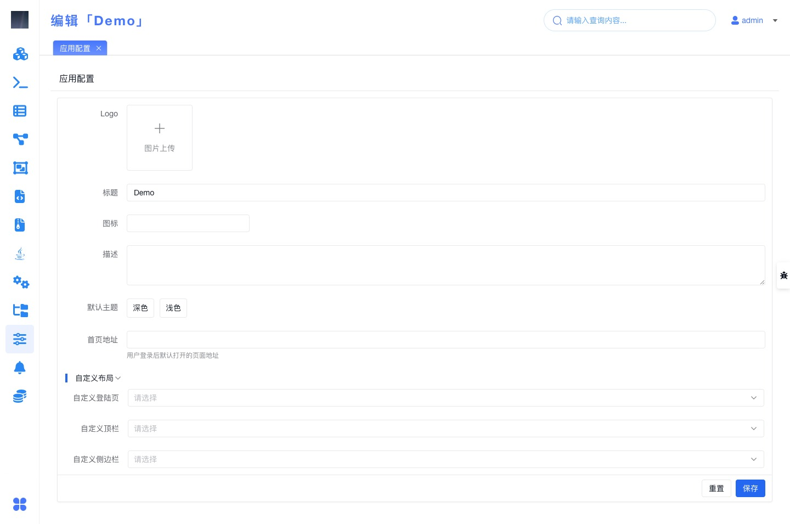

# 开发应用

如果你是从新的手册结构进入这里，这一页对应的是“先创建应用骨架，再进入后续业务开发”的详细操作说明。建议先结合 [创建第一个应用](../../../getting-started/create-first-application) 了解当前主线位置。

潮汐栈支持多人在线同时开发多个应用，因此平台提供了应用管理功能，用于创建和管理应用。

## 你通常会在这里完成什么

- 创建应用骨架
- 打开应用进入业务开发
- 调整应用的基础展示和入口配置
- 为后续页面、流程、权限和前端扩展准备应用级容器

## 应用管理入口

登录开发平台后，默认打开的通常就是 `打开应用` 页面。这里既是应用管理入口，也是进入具体应用开发的起点。

## 常见任务

### 创建应用

创建应用时，最关键的是先把应用标识和显示名称定稳定，后续模型、页面和菜单都会围绕它展开。

| 属性         | 必填 | 说明                        |
| ------------ | ---- | --------------------------- |
| **应用名**   | 是   | 应用的名称标识 **不可重复** |
| **应用标题** | 是   | 应用的显示名                |
| 图标         | 否   | 在应用管理界面显示的图标    |
| 描述         | 否   | 应用的描述信息              |

创建完成后，通常下一步会进入 [业务模型](../business-model/) 或直接查看 [开发业务模型](../business-model/develop-business-model/)。

### 打开应用并进入业务模型

打开应用后，默认会进入 `业务模型` 管理界面：

业务模型是应用的核心模块，用于定义实体、关系、属性、操作等主要业务结构。

### 调整应用配置

通过左侧菜单打开 `应用配置` 后，可以继续调整应用的展示信息和运行时入口。

| 属性       | 必填 | 说明                             |
| ---------- | ---- | -------------------------------- |
| Logo       | 否   | 应用运行时界面中显示的应用 Logo  |
| 标题       | 是   | 应用的显示名                     |
| 图标       | 否   | 应用管理界面显示的图标           |
| 描述       | 否   | 应用的描述信息                   |
| 默认主题   | 否   | 应用的默认主题                   |
| 首页地址   | 否   | 应用登录后的默认打开页面         |
| 自定义布局 | -    | 应用布局的一些布局选项，详见下表 |

**自定义布局**

| 属性         | 说明                                                                                                                   |
| ------------ | ---------------------------------------------------------------------------------------------------------------------- |
| 自定义登录页 | 自定义登录页，需要先在[微前端管理](../../advance/extend-frontend/)中定义或上传微前端应用类型的微前端                   |
| 自定义顶栏   | 自定义顶栏，需要先在[微前端管理](../../advance/extend-frontend/)中定义或上传布局组件（管理界面类型名为“微前端组件”）   |
| 自定义侧边栏 | 自定义侧边栏，需要先在[微前端管理](../../advance/extend-frontend/)中定义或上传布局组件（管理界面类型名为“微前端组件”） |

## 使用建议

如果你只是第一次上手，建议先保持默认布局，先把业务模型、页面和流程跑通；需要做登录页、顶栏或侧边栏定制时，再进入 [融合开发](../../../fusion-development/) 或对应的微前端扩展页。
