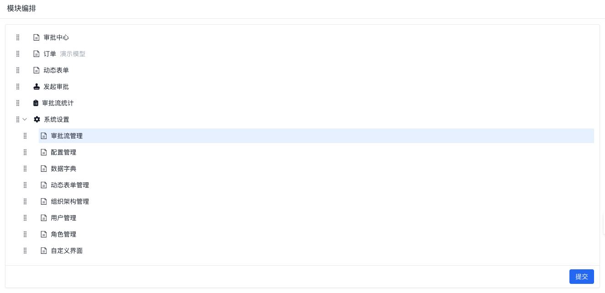

# 模块编排

> 关于 `模块` 概念的具体定义，请参考核心概念中的 [模块模型](/docs/concepts/module-model/)

模块编排用于调整应用在运行时看到的模块顺序与层级。它适合处理“技术上怎么拆模块”和“业务上怎么给用户展示模块”之间的差异。

## 什么时候需要模块编排

- 模块已经建好了，但导航顺序还不符合业务使用习惯
- 不同模块的层级关系需要按业务场景重新组织
- 你希望在不改动底层模块定义的前提下，调整应用最终展示结构

## 如何使用

在开发平台左侧导航进入 `模块编排` 页面：

你可以通过拖拽方式调整模块顺序和层级，然后提交当前编排结果。

## 使用建议

- 先把模块的大致业务分组想清楚，再做拖拽调整，后续返工会少很多
- 模块编排更适合处理“展示结构”，不要把它当成底层模块定义本身的替代
- 如果模块来源同时包含低代码模块和高代码模块，建议先确认两者的命名和职责边界，再做统一编排

## 模块编排的原理

开发平台将高代码中的功能模块与低代码中的功能模块进行了统一，将两者都抽象为模块，形成统一的模块树，并对该模块树进行编排。

保存编排结果时，开发平台会把结果以 diff 的形式保存到应用中；应用运行时再根据 diff 对模块树做 patch。这样新增或删除功能模块后，不需要每次都手工重写整棵模块树。
