# 开发业务模型

如果你是沿着新的手册主线进入这里，建议先对照以下页面：

1. [业务模型](../)
2. [从需求到交付](../../../../low-code/from-requirement-to-delivery)
3. [字段定义](../../../../concepts/field-define/)

这页主要用于查业务模型编辑器各个配置区的含义与操作方式；当你已经开始编辑具体模型时，再配合这页逐段查看会更顺。

:::info
编辑器界面细节可能与截图略有差异，但主要配置区域、操作入口和字段含义仍可作为参考。
:::

## 你通常会在这里完成什么

- 先把业务对象拆成字段、关联和基础特性
- 决定列表页、表单和详情页是保持自动生成，还是交给页面设计器接管
- 调整搜索、获取单条、新建、更新、删除等标准接口的默认行为
- 为模型补充访问控制、自定义页面或自定义 API

## 建议查看顺序

1. 先完成 `基本信息`、`业务字段` 和 `关联模型`，把模型结构定清楚
2. 再看 `模型特性` 和 `视图配置`，把页面和交互入口跑通
3. 需要联动脚本、接口或权限时，再进入 `接口配置`、`访问控制` 和 `自定义功能`

## 编辑器区域概览

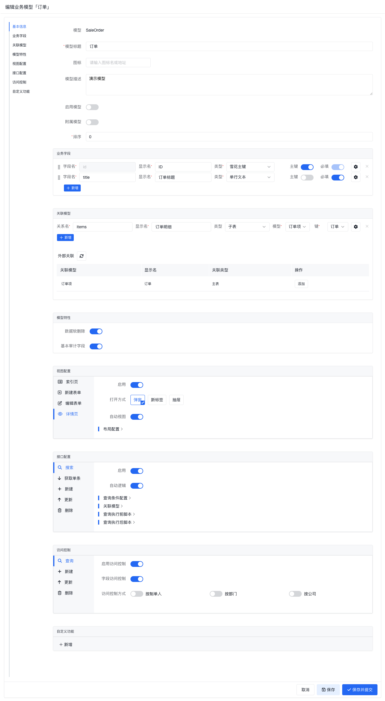

| 配置区域   | 说明                                                 |
| ---------- | ---------------------------------------------------- |
| 基本信息   | 业务模型的基础信息，包括标题、图标、描述和启用状态等 |
| 业务字段   | 定义模型的属性，是大多数业务建模工作的起点           |
| 关联模型   | 定义模型之间的主表、子表和引用关系                   |
| 模型特性   | 打开一些通用能力开关，例如软删除、审计字段等         |
| 视图配置   | 决定列表页、表单和详情页如何生成与展示               |
| 接口配置   | 决定标准 CRUD 接口是否启用、是否自动生成以及如何扩展 |
| 访问控制   | 配置模型的数据访问范围和字段级访问限制               |
| 自定义功能 | 为模型补充额外页面入口或自定义 API                   |

## 基本信息

这里主要决定模型在应用里的身份信息。通常先把标题、图标、是否启用、是否为附属模型等基础属性定下来，再继续做字段和关系设计。

| 属性名   | 必填 | 说明                                           |
| -------- | ---- | ---------------------------------------------- |
| 模型     | -    | 业务模型的完整路径（只读）                     |
| 模型标题 | 是   | 业务模型的标题                                 |
| 图标     | 否   | 业务模型的图标                                 |
| 模型描述 | 否   | 业务模型的描述                                 |
| 启用模型 | -    | 是否启用业务模型，刚创建的模型默认为未启用状态 |
| 附属模型 | -    | 是否为附属模型，附属模型不会生成菜单项等       |
| 排序     | -    | 业务模型在同级模块树中的顺序，正序排序         |

## 业务字段

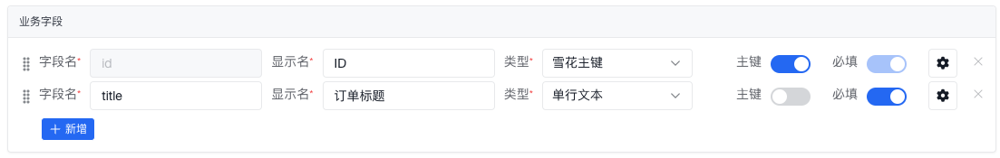

大多数模型设计工作都会先从这里开始。建议先把字段名、类型、是否必填等核心属性定下来，再去补默认值、组件和显示规则。

### 字段基本属性

| 属性名 | 必填 | 说明                                                                                    |
| ------ | ---- | --------------------------------------------------------------------------------------- |
| 字段名 | 是   | 字段的标识性的名字，**建议使用小驼峰命名规范**，生成的数据模型以及 API 地址、页面地址等 |
| 显示名 | 是   | 字段的显示名，一般是中文                                                                |
| 类型   | 是   | 字段的类型，详见 [字段类型](/docs/concepts/field-define)                                |
| 主键   | -    | 是否为主键，主键字段会自动生成唯一标识符，一般用于数据的唯一标识                        |
| 必填   | -    | 是否为必填字段，必填字段在创建数据时必须填写                                            |

打开字段的配置抽屉后，可以继续补充更完整的属性设置：

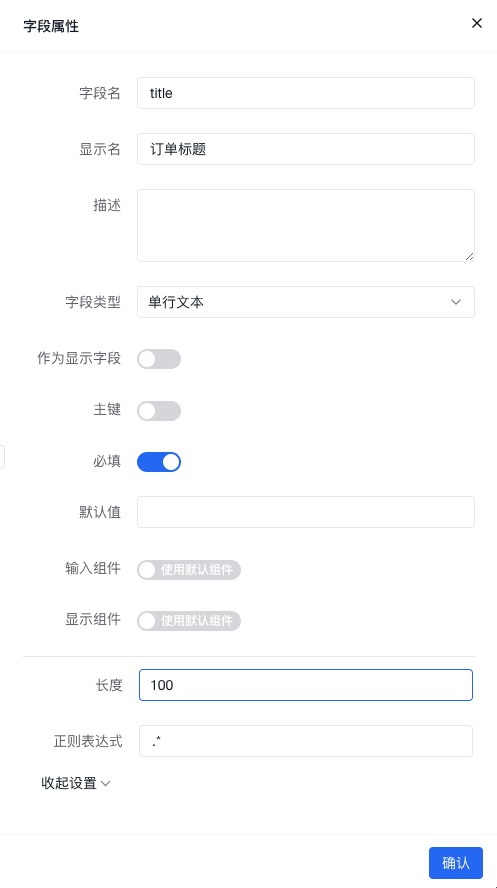

这里不仅包含列表里能直接看到的字段属性，也包含一些更偏展示和运行时行为的设置。

### 更多属性

| 属性名       | 必填 | 说明                                                                                       |
| ------------ | ---- | ------------------------------------------------------------------------------------------ |
| 作为显示字段 | -    | 当模型被其他模型关联时，以该字段值作为显示内容                                             |
| 默认值       | 否   | 字段的默认值表达式，请参考 [表达式](../../expression/)，在表达式的上下文中包含了其他字段值 |
| 输入组件     | -    | 字段的输入组件，详见 [字段定义](/docs/concepts/field-define/)                              |
| 显示组件     | -    | 字段的显示组件，详见 [字段定义](/docs/concepts/field-define/)                              |
| _更多_       | -    | 根据字段类型的不同，会有不同的设置项                                                       |

## 关联模型

当单个模型已经不足以表达业务结构时，就需要在这里建立模型之间的关系，包括主表、子表和引用关系。

如上图所示，关联模型分为两个部分，上半部分是编辑区域，用于编辑本模型与其他模型的关系，下半部分是只读显示区域，显示了其他模型与本模型的关系。

### 添加关联关系

新增关系时，通常要先想清楚“谁依附谁”“谁引用谁”，这样关系类型和关联键会更容易选对。

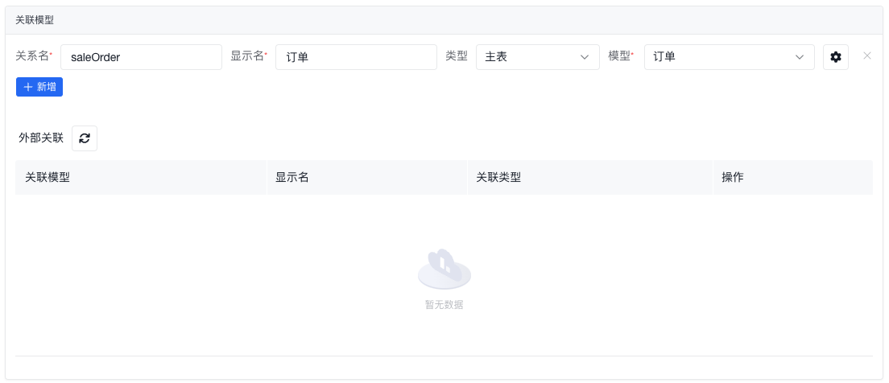

| 属性名   | 必填 | 说明                                           |
| -------- | ---- | ---------------------------------------------- |
| 关系名   | 是   | 关系的标识性的名字，**建议使用小驼峰命名规范** |
| 显示名   | 是   | 关系的显示名，一般是中文                       |
| 关系类型 | 是   | 关系的类型，包括主表、子表和引用三种类型       |
| 模型     | 是   | 关联的业务模型                                 |
| 键       | 是   | **[子表]** 关联的业务模型的关联字段            |
| 同步提交 | 否   | **[子表]** 是否在主表提交时同步提交子表数据    |

**关系类型**

| 关系类型 | 说明                                       |
| -------- | ------------------------------------------ |
| 主表     | 被关联的业务模型是本模型的主表             |
| 子表     | 被关联的业务模型是本模型的子表             |
| 引用     | 被关联的业务模型是本模型的一种引用数据来源 |

### 通过外部关联添加关系

上面例子中，我们在 **订单项** 模型中建立了一个主表关系，关联的模型是 **订单** 模型。然后我们打开 **订单** 模型，可以看到该关系已经在 **订单** 模型的外部关联中显示出来了：

如果另一侧模型已经先建立过关系，可以直接在外部关联区域补齐对应关系：

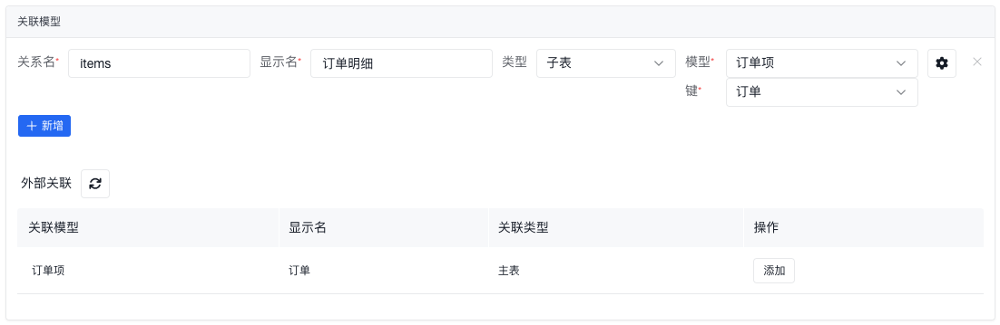

这时通常只需要补充**关系名**和**显示名**即可。

## 模型特性

模型特性用于给模型补充一些通用能力开关。截图中的典型例子包括：

- 数据软删除
- 基本审计字段

不同版本里这里看到的特性项可能略有差异，但理解方式基本一致：它们是在现有字段和关系之外，为模型叠加一层通用运行能力。

## 视图配置

这里决定模型最终会以什么页面形式暴露给用户，以及是继续使用自动生成页面，还是转到页面设计器做更细粒度的定制。

### 索引页

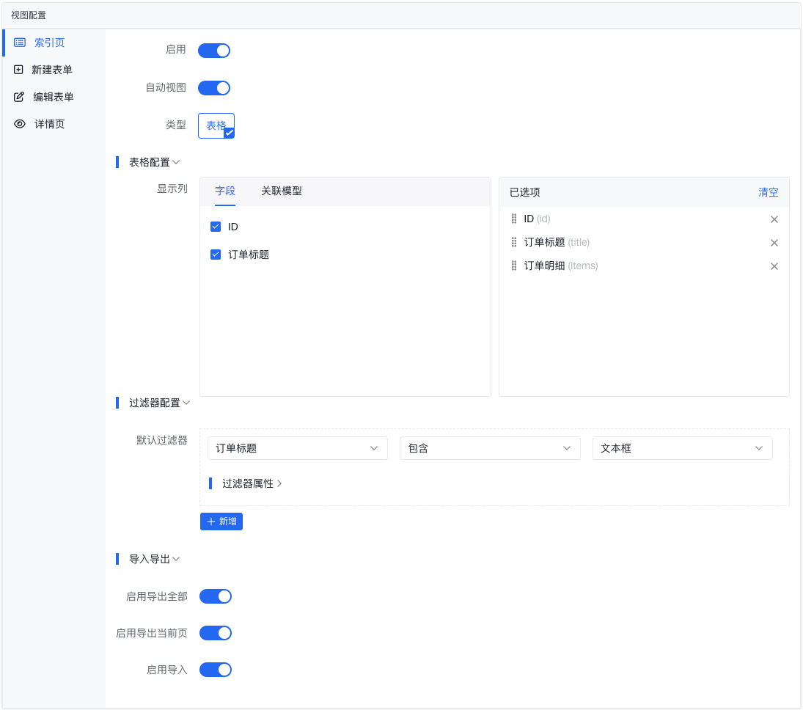

| 属性名                    | 必填 | 说明                                                       |
| ------------------------- | ---- | ---------------------------------------------------------- |
| 启用                      | -    | 是否启用本模型的索引页                                     |
| 自动视图                  | -    | 是否自动生成索引页；关闭后可进入 `页面设计器` 做自定义布局 |
| 类型                      | 是   | 索引页的类型                                               |
| 表格配置 - 显示列         | 否   | 索引页的表格配置，若不设置则显示全部字段与关联关系         |
| 过滤器配置 - 默认过滤器   | 否   | 索引页上的搜索条件                                         |
| 导入导出 - 启用导出全部   | -    | 是否启用导出全部功能                                       |
| 导入导出 - 启用导出当前页 | -    | 是否启用导出当前页功能                                     |
| 导入导出 - 启用导入       | -    | 是否启用导入功能                                           |
| 页面设计器                | -    | **[自动视图:关闭]** 打开页面设计器，自定义索引页布局与样式 |

### 新建表单

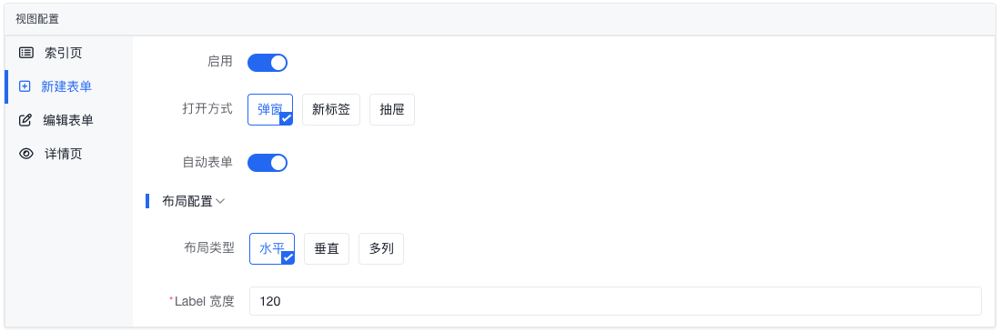

| 属性名                | 必填 | 说明                                                 |
| --------------------- | ---- | ---------------------------------------------------- |
| 启用                  | -    | 是否启用本模型的新建表单                             |
| 打开方式              | 是   | 新建表单的打开方式                                   |
| 自动表单              | -    | 是否自动生成新建表单；关闭后可进入 `页面设计器` 调整 |
| 布局配置 - 布局类型   | 是   | 新建表单的布局类型                                   |
| 布局配置 - Label 宽度 | 是   | **[水平和多列布局]** 新建表单的 Label 宽度           |
| 布局配置 - 列数       | 是   | 当布局方式为多列时，指定每行多少列                   |
| 表单设计器            | -    | **[自动表单:关闭]** 打开页面设计器，自定义表单布局   |

### 编辑表单

与新建表单的配置方式类似，通常重点在于可编辑字段、默认值和布局是否符合修改场景。

### 详情页

与新建表单的配置方式类似，但更偏向展示结构、信息分组和只读呈现方式。

## 接口配置

:::info
接口配置里的脚本，适合用来在标准 CRUD 前后补业务规则、数据加工和返回值调整。脚本上下文请参考 [脚本上下文](/docs/api/backend/script-context/)。
:::

如果默认 CRUD 已经够用，建议优先保持 `自动逻辑` 开启；只有当标准行为明显不够时，再考虑增加执行前/执行后脚本，或完全切换到自定义脚本。

### 搜索

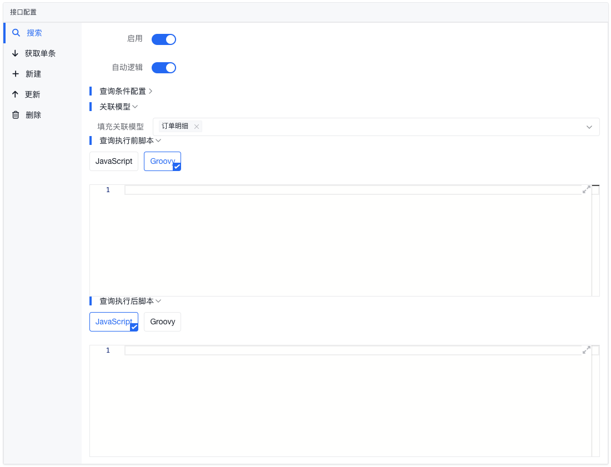

| 属性名                | 必填 | 说明                                                                       |
| --------------------- | ---- | -------------------------------------------------------------------------- |
| 启用                  | -    | 是否启用搜索接口                                                           |
| 自动逻辑              | -    | 是否自动生成搜索接口的逻辑                                                 |
| 查询条件配置          | -    | 用于进一步约束搜索条件，当前以界面中实际可配置项为准                       |
| 关联模型-填充关联模型 | 否   | 选择要自动填充数据的关联模型                                               |
| 查询执行前脚本        | 否   | 在查询参数准备完成后，查询之前要执行的脚本 [脚本参数](#查询执行前脚本参数) |
| 查询执行后脚本        | 否   | 在查询执行完成后，返回结果前要执行的脚本 [脚本参数](#查询执行后脚本参数)   |
| 自定义脚本            | 否   | **自动逻辑:关闭** 自定义搜索接口的逻辑脚本 [脚本参数](#自定义脚本参数)     |

#### 查询执行前脚本参数

| 参数名          | 类型         | 说明                                                                             |
| --------------- | ------------ | -------------------------------------------------------------------------------- |
| **query**       | Map          | 结构化查询 DSL，具体结构请参考 [数据查询 DSL](/docs/api/backend/data-query-dsl/) |
| - select        | String\|List | 显示字段 _也可以在上下文中直接访问_                                              |
| - where         | Map          | 查询条件 _也可以在上下文中直接访问_                                              |
| - sort          | String       | 排序条件 _也可以在上下文中直接访问_                                              |
| - skip          | Integer      | 分页条件，计算公式：(页码 - 1) \* 每页数量 _也可以在上下文中直接访问_        |
| - limit         | Integer      | 分页条件，每页数量 _也可以在上下文中直接访问_                                    |
| - populate      | List         | 自动填充的关联模型 _也可以在上下文中直接访问_                                    |
| **request**     | Map          | 请求参数                                                                         |
| - method        | String       | 请求方法                                                                         |
| - uri           | URI          | 请求地址                                                                         |
| - path          | String       | 请求路径                                                                         |
| - queryString   | String       | 请求参数                                                                         |
| - protocol      | String       | 请求协议                                                                         |
| - host          | String       | 请求主机                                                                         |
| - port          | Integer      | 请求端口                                                                         |
| - remoteAddress | String       | 请求客户端地址                                                                   |
| - pathVariables | Map          | 请求路径参数                                                                     |
| - headers       | Map          | 请求头                                                                           |
| - body          | Map          | 请求体                                                                           |

> 若要修改查询条件等，需要在脚本中返回一个 Map，结构与上下文中的 query 一致。 
> 若不想修改查询条件，要么在代码中留空，要么将上下文中的 query 对象返回。

#### 查询执行后脚本参数

| 参数名      | 类型    | 说明                                        |
| ----------- | ------- | ------------------------------------------- |
| **result**  | Map     | 查询结果                                    |
| - items     | List    | 查询结果列表 _也可以在上下文中直接访问_     |
| - total     | Integer | 查询结果总数 _也可以在上下文中直接访问_     |
| **request** | Map     | 请求参数，[请参考这里](#查询执行前脚本参数) |

> 若要修改查询结果，需要在脚本中返回一个 Map，结构与上下文中的 result 一致。 
> 若不想修改查询结果，要么在代码中留空，要么将上下文中的 result 对象返回。

#### 自定义脚本参数

| 参数名      | 类型 | 说明                                        |
| ----------- | ---- | ------------------------------------------- |
| **request** | Map  | 请求参数，[请参考这里](#查询执行前脚本参数) |

> 脚本的返回值会直接返回给HTTP响应，默认会加一层WebAPI包裹后序列化为JSON字符串。 
> 为保证接口的一致性，建议返回一个 Map，结构与上面的 [result](#查询执行后脚本参数) 一致。

### 获取单条

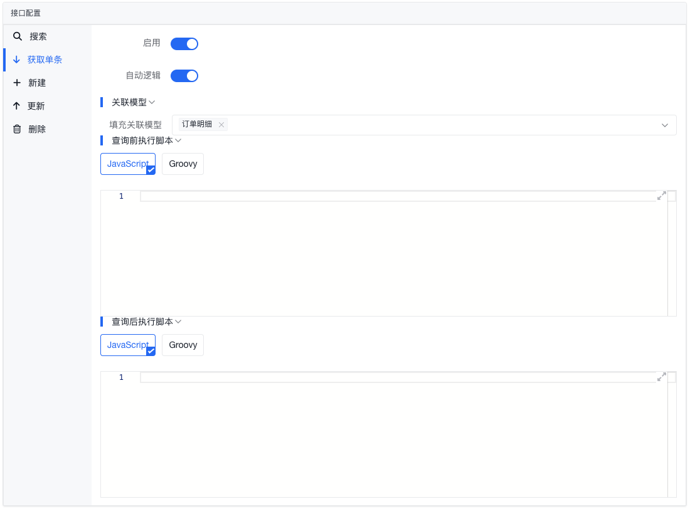

| 属性名                | 必填 | 说明                                                                         |
| --------------------- | ---- | ---------------------------------------------------------------------------- |
| 启用                  | -    | 是否启用获取单条接口                                                         |
| 自动逻辑              | -    | 是否自动生成获取单条接口的逻辑                                               |
| 关联模型-填充关联模型 | 否   | 选择要自动填充数据的关联模型                                                 |
| 查询执行前脚本        | 否   | 在查询参数准备完成后，查询之前要执行的脚本 [脚本参数](#查询执行前脚本参数-1) |
| 查询执行后脚本        | 否   | 在查询执行完成后，返回结果前要执行的脚本 [脚本参数](#查询执行后脚本参数-1)   |
| 自定义脚本            | 否   | **自动逻辑:关闭** 自定义获取单条接口的逻辑脚本 [脚本参数](#自定义脚本参数-1) |

#### 查询执行前脚本参数

| 参数名        | 类型         | 说明                                                                             |
| ------------- | ------------ | -------------------------------------------------------------------------------- |
| **statement** | Map          | 结构化查询 DSL，具体结构请参考 [数据查询 DSL](/docs/api/backend/data-query-dsl/) |
| - select      | String\|List | 显示字段 _也可以在上下文中直接访问_                                              |
| - where       | Map          | 查询条件 _也可以在上下文中直接访问_                                              |
| - populate    | List         | 自动填充的关联模型 _也可以在上下文中直接访问_                                    |
| **request**   | Map          | 请求参数，[请参考这里](#查询执行前脚本参数)                                      |

> 若要修改查询条件等，需要在脚本中返回一个 Map，结构与上下文中的 statement 一致。 
> 若不想修改查询条件，要么在代码中留空，要么将上下文中的 statement 对象返回。

#### 查询执行后脚本参数

| 参数名      | 类型 | 说明                                        |
| ----------- | ---- | ------------------------------------------- |
| **record**  | Map  | 查询结果                                    |
| **request** | Map  | 请求参数，[请参考这里](#查询执行前脚本参数) |

> 若要修改查询结果，需要在脚本中返回一个 Map。 
> 若不想修改查询结果，要么在代码中留空，要么将上下文中的 record 对象返回。

#### 自定义脚本参数

| 参数名      | 类型 | 说明                                        |
| ----------- | ---- | ------------------------------------------- |
| **request** | Map  | 请求参数，[请参考这里](#查询执行前脚本参数) |

> 脚本的返回值会直接返回给HTTP响应，默认会加一层WebAPI包裹后序列化为JSON字符串。 
> 为保证接口的一致性，建议返回一个 Map 或实体对象，结构与模型定义一致。

### 新建

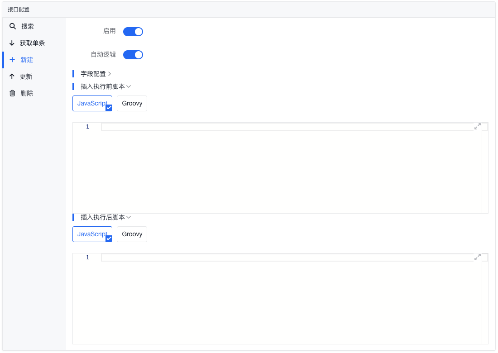

| 属性名         | 必填 | 说明                                                                           |
| -------------- | ---- | ------------------------------------------------------------------------------ |
| 启用           | -    | 是否启用新建接口                                                               |
| 自动逻辑       | -    | 是否自动生成新建接口的逻辑                                                     |
| 字段配置       | -    | 用于约束可写字段，当前以界面中实际可配置项为准                                 |
| 插入执行前脚本 | 否   | 在新建参数准备完成后，插入操作之前要执行的脚本 [脚本参数](#插入执行前脚本参数) |
| 插入执行后脚本 | 否   | 在插入操作执行完成后，返回结果前要执行的脚本 [脚本参数](#插入执行后脚本参数)   |
| 自定义脚本     | 否   | **自动逻辑:关闭** 自定义新建接口的逻辑 [脚本参数](#自定义脚本参数-2)           |

#### 插入执行前脚本参数

| 参数名      | 类型 | 说明                                        |
| ----------- | ---- | ------------------------------------------- |
| **data**    | Map  | 要插入的数据                                |
| **request** | Map  | 请求参数，[请参考这里](#查询执行前脚本参数) |

> 若要修改插入的数据，需要在脚本中返回一个 Map，结构与上下文中的 data 一致。 
> 若不想修改插入的数据，要么在代码中留空，要么将上下文中的 data 对象返回。

#### 插入执行后脚本参数

| 参数名      | 类型 | 说明                                        |
| ----------- | ---- | ------------------------------------------- |
| **data**    | Map  | 插入完成后返回的写入数据库中的完整数据      |
| **request** | Map  | 请求参数，[请参考这里](#查询执行前脚本参数) |

> 若要修改返回结果，需要在脚本中返回一个 Map。 
> 若不想修改返回结果，要么在代码中留空，要么将上下文中的 data 对象返回。

#### 自定义脚本参数

| 参数名      | 类型 | 说明                                        |
| ----------- | ---- | ------------------------------------------- |
| **request** | Map  | 请求参数，[请参考这里](#查询执行前脚本参数) |

> 脚本的返回值会直接返回给HTTP响应，默认会加一层WebAPI包裹后序列化为JSON字符串。 
> 为保证接口的一致性，建议返回一个 Map 或实体对象，结构与模型定义一致。

### 更新

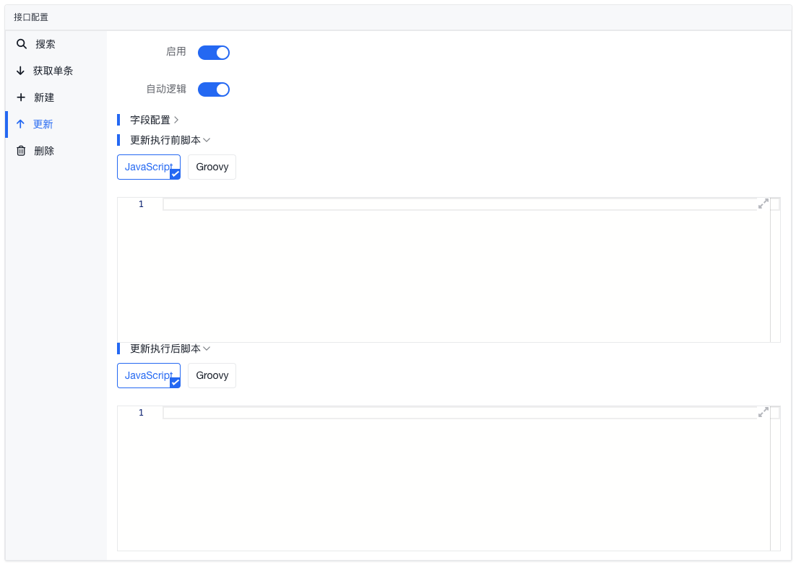

| 属性名         | 必填 | 说明                                                                           |
| -------------- | ---- | ------------------------------------------------------------------------------ |
| 启用           | -    | 是否启用更新接口                                                               |
| 自动逻辑       | -    | 是否自动生成更新接口的逻辑                                                     |
| 字段配置       | -    | 用于约束可更新字段，当前以界面中实际可配置项为准                               |
| 更新执行前脚本 | 否   | 在更新参数准备完成后，更新操作之前要执行的脚本 [脚本参数](#更新执行前脚本参数) |
| 更新执行后脚本 | 否   | 在更新执行完成后，返回结果前要执行的脚本 [脚本参数](#更新执行后脚本参数)       |
| 自定义脚本     | 否   | **自动逻辑:关闭** 自定义更新接口的逻辑脚本 [脚本参数](#自定义脚本参数-3)       |

#### 更新执行前脚本参数

| 参数名        | 类型 | 说明                                        |
| ------------- | ---- | ------------------------------------------- |
| **statement** | Map  | 更新数据和更新条件                          |
| - data        | Map  | 要更新的数据                                |
| - where       | Map  | 更新条件                                    |
| **request**   | Map  | 请求参数，[请参考这里](#查询执行前脚本参数) |

> 若要修改更新条件或更新数据，需要在脚本中返回一个 Map，结构与上下文中的 statement 一致。 
> 若不想修改更新参数，要么在代码中留空，要么将上下文中的 statement 对象返回。

#### 更新执行后脚本参数

| 参数名      | 类型 | 说明                                        |
| ----------- | ---- | ------------------------------------------- |
| **updated** | Long | 更新数据条数                                |
| **request** | Map  | 请求参数，[请参考这里](#查询执行前脚本参数) |

> 若要修改返回结果，需要在脚本中返回一个值，并与调用方约定好结构。 
> 若不想修改返回结果，要么在代码中留空，要么将上下文中的 updated 值返回。

#### 自定义脚本参数

| 参数名      | 类型 | 说明                                        |
| ----------- | ---- | ------------------------------------------- |
| **request** | Map  | 请求参数，[请参考这里](#查询执行前脚本参数) |

> 脚本的返回值会直接返回给HTTP响应，默认会加一层WebAPI包裹后序列化为JSON字符串。 
> 为保证接口的一致性，建议返回一个数字类型，表示更新的数据条数。 
> 也可以根据需要返回一个 Map 或实体对象，结构与模型定义一致。

### 删除

| 属性名         | 必填 | 说明                                                                           |
| -------------- | ---- | ------------------------------------------------------------------------------ |
| 启用           | -    | 是否启用删除接口                                                               |
| 自动逻辑       | -    | 是否自动生成删除接口的逻辑                                                     |
| 删除执行前脚本 | 否   | 在删除参数准备完成后，执行删除之前要执行的脚本 [脚本参数](#删除执行前脚本参数) |
| 删除执行后脚本 | 否   | 在删除执行完成后，返回结果前要执行的脚本 [脚本参数](#删除执行后脚本参数)       |
| 自定义脚本     | 否   | **自动逻辑:关闭** 自定义删除接口的逻辑 [脚本参数](#自定义脚本参数-4)           |

#### 删除执行前脚本参数

| 参数名      | 类型 | 说明                                                                               |
| ----------- | ---- | ---------------------------------------------------------------------------------- |
| **where**   | Map  | 要删除条件表达式，具体格式请参考 [数据查询 DSL](/docs/api/backend/data-query-dsl/) |
| **request** | Map  | 请求参数，[请参考这里](#查询执行前脚本参数)                                        |

#### 删除执行后脚本参数

| 参数名      | 类型 | 说明                                        |
| ----------- | ---- | ------------------------------------------- |
| **deleted** | Long | 删除数据条数                                |
| **request** | Map  | 请求参数，[请参考这里](#查询执行前脚本参数) |

#### 自定义脚本参数

| 参数名      | 类型 | 说明                                        |
| ----------- | ---- | ------------------------------------------- |
| **request** | Map  | 请求参数，[请参考这里](#查询执行前脚本参数) |

> 脚本的返回值会直接返回给HTTP响应，默认会加一层WebAPI包裹后序列化为JSON字符串。 
> 若没有特殊返回要求，可以直接返回删除条数，或按业务需要返回一个 Map。

---

## 访问控制

:::warning

请注意，这里的访问控制并不是在分配访问控制权限，而是在配置 **要开启的访问控制选项**。 具体的权限配置需要在应用的 **[用户角色管理](/docs/guide/module/rbac/)** 中进行。

:::

这里的重点不是“给谁授权”，而是“模型本身支持哪些访问控制维度”。真正的角色授权分配，仍然需要回到 [用户角色管理](/docs/guide/module/rbac/) 里完成。

### 查询

| 属性名                 | 必填 | 说明                                                                                             |
| ---------------------- | ---- | ------------------------------------------------------------------------------------------------ |
| 启用访问控制           | -    | 是否启用查询访问控制                                                                             |
| 字段访问控制           | -    | 是否允许开启字段查询与显示的控制                                                                 |
| 访问控制方式: 按制单人 | -    | 是否开启按制单人进行访问控制，比如限制某些角色只能查询自己创建的数据                             |
| 访问控制方式: 按部门   | -    | 按部门进行访问控制： 可以选择按所属部门（以及是否包含下属部门）； 也可以指定具体部门。   |
| 访问控制方式: 按公司   | -    | 按公司进行访问控制： 可以选择按所属公司（以及是否包含下属子公司）； 也可以指定具体公司。 |

### 新建

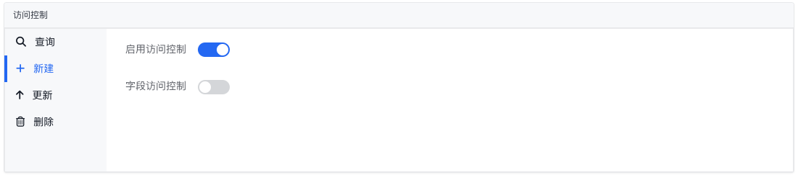

| 属性名       | 必填 | 说明                                       |
| ------------ | ---- | ------------------------------------------ |
| 启用访问控制 | -    | 是否启用新建访问控制                       |
| 字段访问控制 | -    | 是否允许指定在新建数据的时候限制提交的字段 |

### 更新

| 属性名                 | 必填 | 说明                                                                                             |
| ---------------------- | ---- | ------------------------------------------------------------------------------------------------ |
| 启用访问控制           | -    | 是否启用更新访问控制                                                                             |
| 字段访问控制           | -    | 是否允许指定在更新数据的时候修改哪些字段                                                         |
| 访问控制方式: 按制单人 | -    | 是否开启按制单人进行访问控制，比如限制某些角色只能更新自己创建的数据                             |
| 访问控制方式: 按部门   | -    | 按部门进行访问控制： 可以选择按所属部门（以及是否包含下属部门）； 也可以指定具体部门。   |
| 访问控制方式: 按公司   | -    | 按公司进行访问控制： 可以选择按所属公司（以及是否包含下属子公司）； 也可以指定具体公司。 |

### 删除

| 属性名                 | 必填 | 说明                                                                                             |
| ---------------------- | ---- | ------------------------------------------------------------------------------------------------ |
| 启用访问控制           | -    | 是否启用删除访问控制                                                                             |
| 访问控制方式: 按制单人 | -    | 是否开启按制单人进行访问控制，比如限制某些角色只能删除自己创建的数据                             |
| 访问控制方式: 按部门   | -    | 按部门进行访问控制： 可以选择按所属部门（以及是否包含下属部门）； 也可以指定具体部门。   |
| 访问控制方式: 按公司   | -    | 按公司进行访问控制： 可以选择按所属公司（以及是否包含下属子公司）； 也可以指定具体公司。 |

---

## 自定义功能

当标准的列表页、表单页和 CRUD API 还不够时，可以在这里为模型补充额外入口。

新增一个自定义功能后，通常会继续决定它是作为页面能力出现，还是作为 API 能力出现：

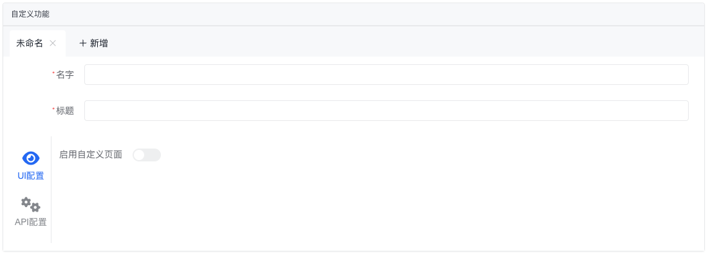

其中**名字**一般作为内部标识，**标题**用于页面或按钮上的展示文案。

### UI 配置

如果这个能力需要直接给用户一个操作入口，就可以启用自定义页面：

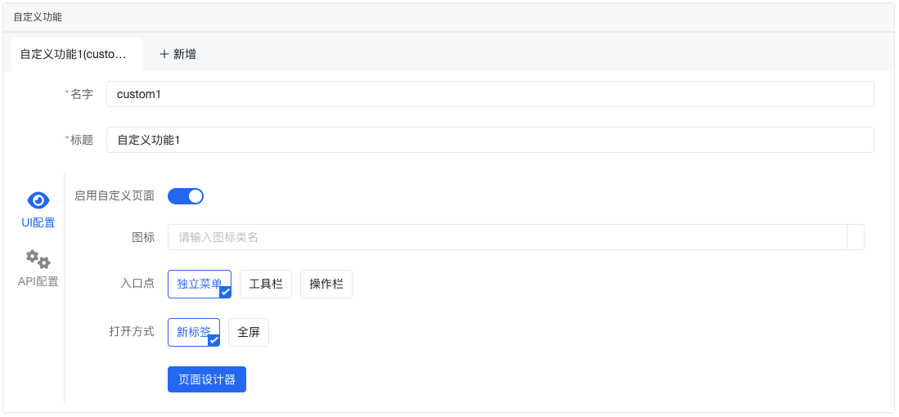

| 属性名     | 必填 | 说明                               |
| ---------- | ---- | ---------------------------------- |
| 图标       | 否   | 自定义功能的按钮图标或菜单的图标   |
| 入口点     | 是   | 自定义功能的入口点                 |
| 打开方式   | 是   | 自定义功能的打开方式               |
| 页面设计器 | -    | 打开页面设计器，用于自定义页面布局 |

#### 入口点

| 入口点   | 说明                                 |
| -------- | ------------------------------------ |
| 独立菜单 | 以导航菜单的形式呈现                 |
| 工具栏   | 在列表的工具栏上以按钮的形式出现     |
| 操作栏   | 在数据记录的操作列中以按钮的形式出现 |

#### 打开方式（独立菜单）

| 打开方式 | 说明             |
| -------- | ---------------- |
| 新标签   | 在新标签页中打开 |
| 全屏     | 以全屏的形式打开 |

#### 打开方式（工具栏、操作栏）

| 打开方式 | 说明             |
| -------- | ---------------- |
| 弹窗     | 在弹窗中打开     |
| 新标签   | 在新标签页中打开 |
| 抽屉     | 在抽屉中打开     |

### API 配置

如果这个能力更适合由前端或外部系统调用，可以启用自定义 API：

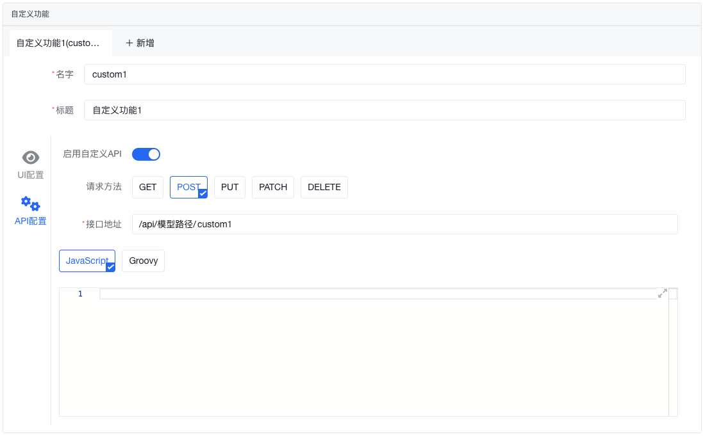

| 属性名   | 必填 | 说明                  |
| -------- | ---- | --------------------- |
| 请求方法 | 是   | 自定义 API 的请求方法 |
| 接口地址 | 是   | 自定义 API 的请求路径 |

#### 自定义脚本参数

| 参数名      | 类型 | 说明                                        |
| ----------- | ---- | ------------------------------------------- |
| **request** | Map  | 请求参数，[请参考这里](#查询执行前脚本参数) |

:::info
脚本中可用的工具类和上下文对象，请参考 [脚本上下文](/docs/api/backend/script-context/)。
:::

## 使用建议

- 先把模型结构定清楚，再去调页面和接口；反过来做通常会带来更多返工
- 自动视图和自动逻辑往往足够支撑第一版业务闭环，建议先跑通，再决定是否切到页面设计器或自定义脚本
- 一旦涉及角色、组织、审批或通知联动，最好把对应模块一起联调，而不是只在业务模型页里单独验证
