# 业务模型

> 详情请参考核心概念中的 [业务模型](/docs/concepts/business-model/)。

业务模型是应用的**核心模块**，用于定义业务功能，包括实体、属性、关系、操作、视图、菜单和权限等。

如果你是沿着新的手册主线进入这里，建议先对照以下页面：

1. [低代码开发总览](../../../low-code/overview)
2. [从需求到交付](../../../low-code/from-requirement-to-delivery)
3. [开发业务模型](./develop-business-model)

这页主要用于说明业务模型管理界面和常见操作入口；如果你想按步骤真正把模型做出来，继续看 [开发业务模型](./develop-business-model) 会更直接。

## 你通常会在这里完成什么

- 创建业务模型骨架
- 打开模型进入编辑器
- 在列表里维护模型状态和版本
- 查看模型详情和变更记录

## 业务模型管理界面

通过菜单进入 `业务模型` 后，会看到业务模型管理界面：

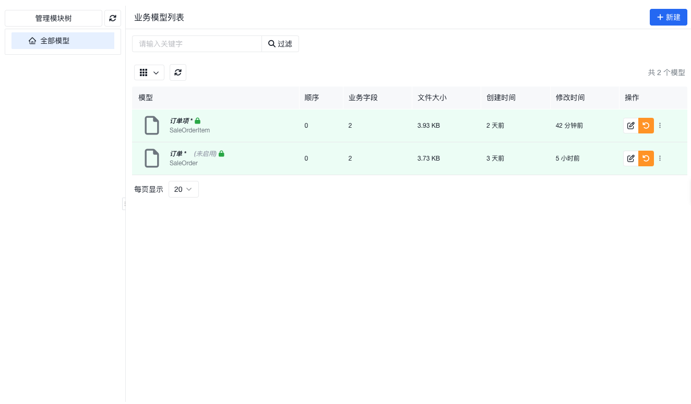

- 左侧是**模块树**，模块树是业务模型的组织结构，类似于文件夹，主要用于对业务模型进行分类管理。
- 右侧是**业务模型列表**，展示了当前模块下的业务模型，以便与对业务模型进行查看、编辑、删除等操作。

## 常见任务

### 创建业务模型

创建模型时，最关键的是先把模型标识、标题和大致业务边界定清楚。

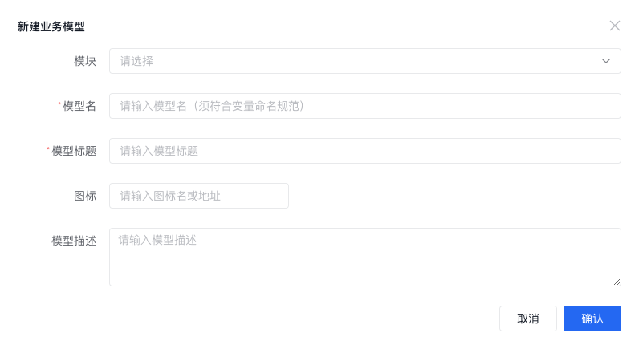

| 属性名   | 必填 | 说明                                                                                                 |
| -------- | ---- | ---------------------------------------------------------------------------------------------------- |
| 模块     | 否   | 指定业务模型在模块树上的位置                                                                         |
| 模型名   | 是   | 业务模型的标识性的名字，**建议使用大驼峰命名规范** _数据模型以及 API 地址、页面地址等都与之相关_ |
| 模型标题 | 是   | 业务模型的显示名，一般是中文                                                                         |
| 图标     | 否   | 业务模型的图标，同时也会作为其菜单的图标                                                             |
| 模型描述 | 否   | 非必填，描述性信息                                                                                   |

### 打开并编辑业务模型

:::info
编辑器界面细节可能与截图略有差异，但整体流程和字段含义仍可作为参考。
:::

打开模型后会进入业务模型编辑器：

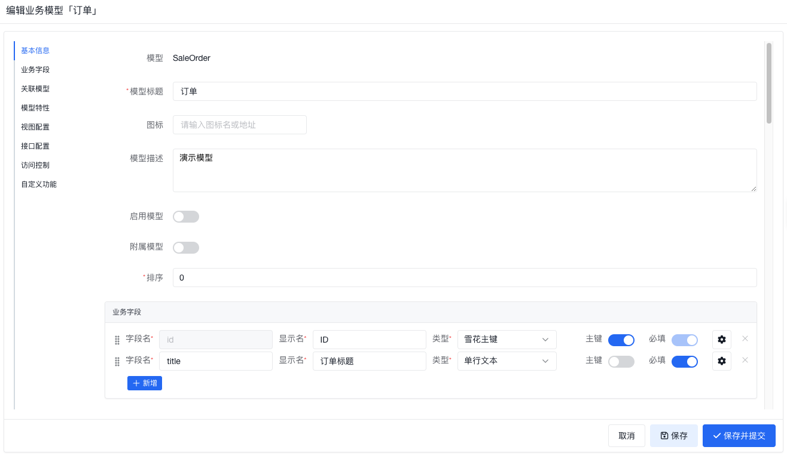

详细的编辑操作，请参考 [开发业务模型](./develop-business-model)。

### 保存、提交和回滚

业务模型具备版本管理能力。编辑过程中可以先保存草稿，再决定是否提交到版本库。

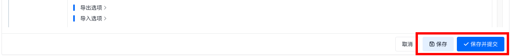

只有执行 `保存并提交` 并填写提交信息后，当前修改才会真正进入版本库。

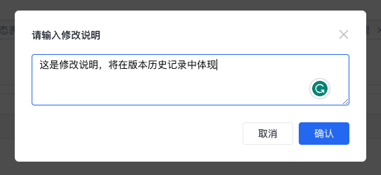

提交后，可以查看模型的[变更记录](#查看变更记录)。

如果当前修改需要放弃，可以通过 `放弃变更并解锁` 回滚到上一次提交的版本。

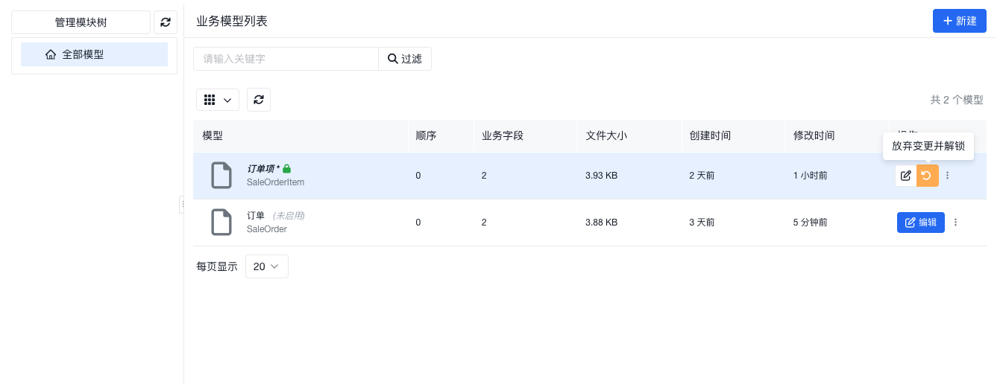

### 重命名、移动和删除

处于非编辑状态下的模型，通常可以在列表中进行重命名、移动或删除。

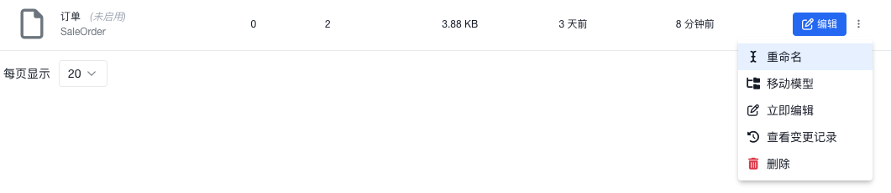

### 查看业务模型详情

列表中也可以直接打开模型详情弹窗查看当前定义。

#### 基本信息

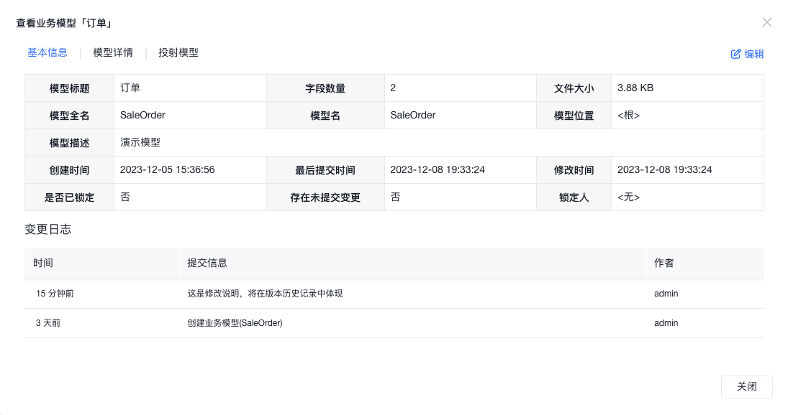

#### 模型详情

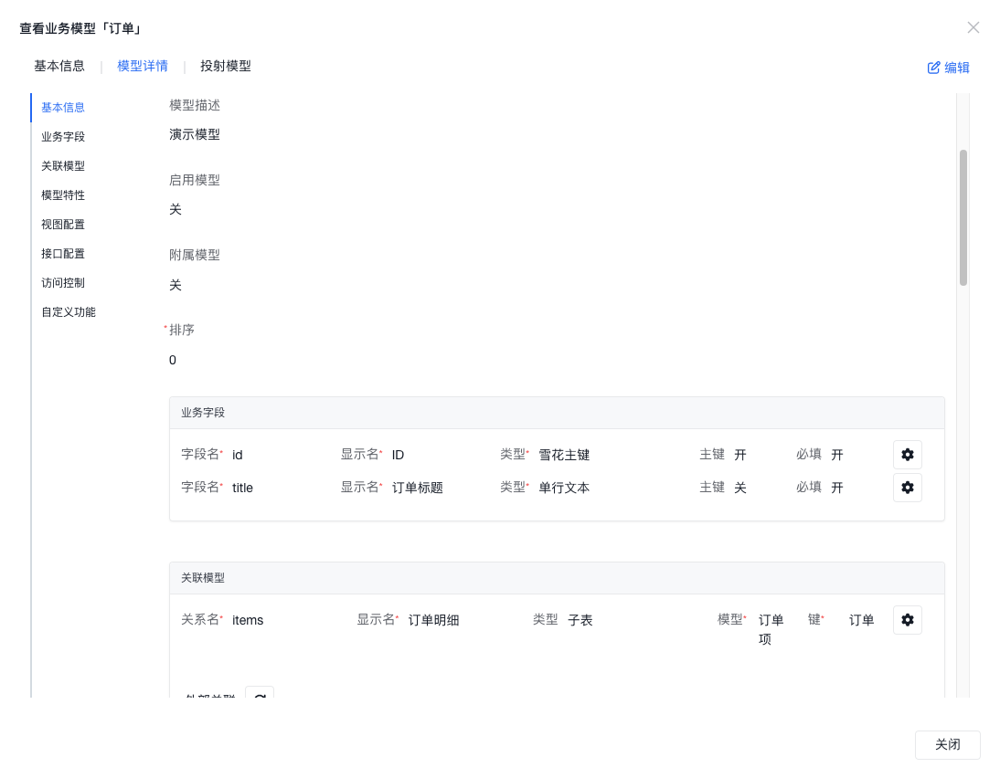

#### 投射模型

关于业务模型的投射模型概念，请参考 **核心概念** 中的 [业务模型](/docs/concepts/business-model/)。

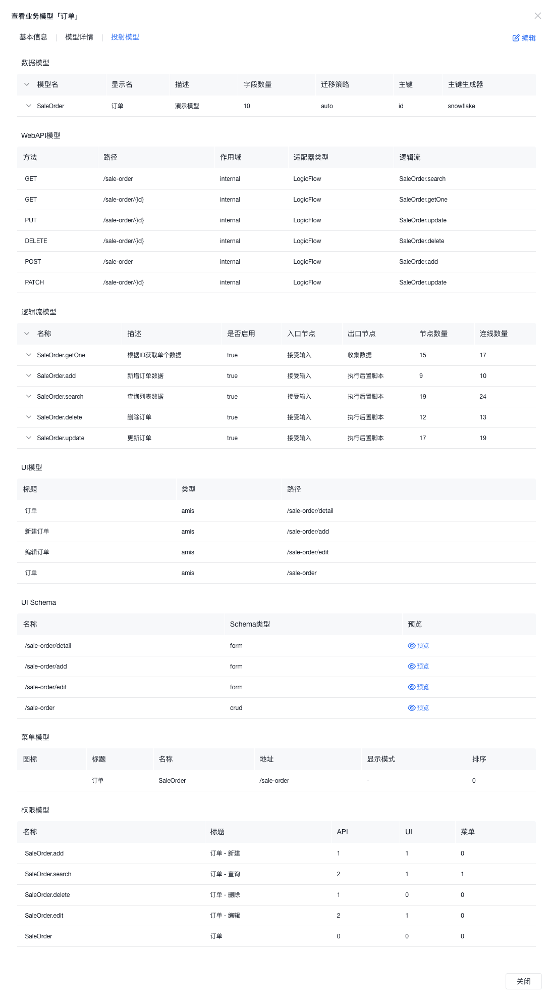

### 查看变更记录

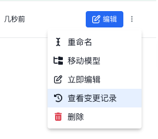

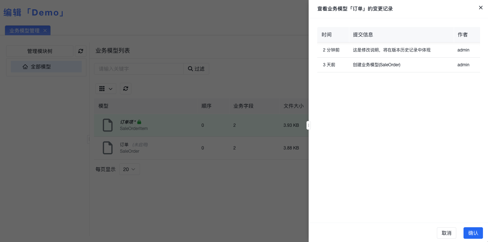

## 使用建议

- 先把模型名、模型标题和大致边界想清楚，再开始补字段和关系，后续调整会少很多
- 先完成最小模型，再逐步增加菜单、视图和操作，通常比一次性铺开更容易验证
- 如果你当前卡在字段、关系或行为设计上，优先进入 [开发业务模型](./develop-business-model)
