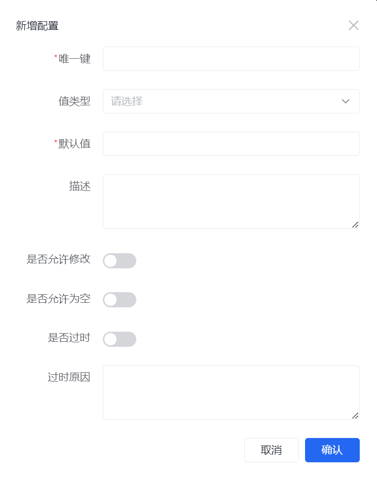
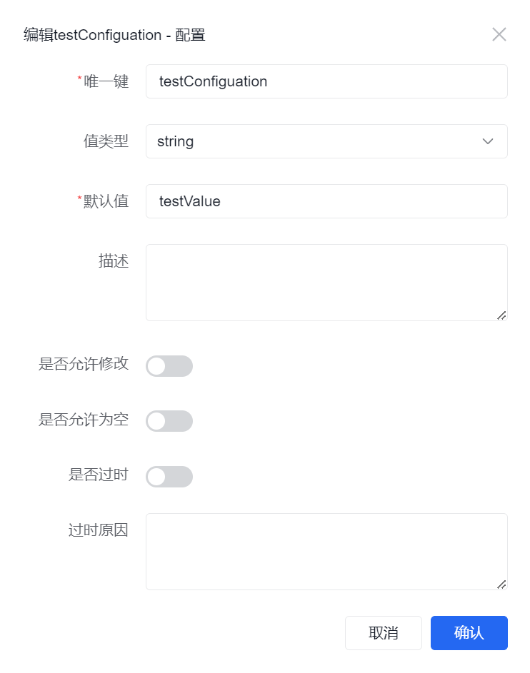
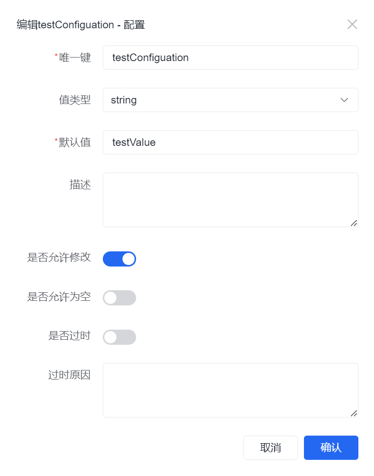
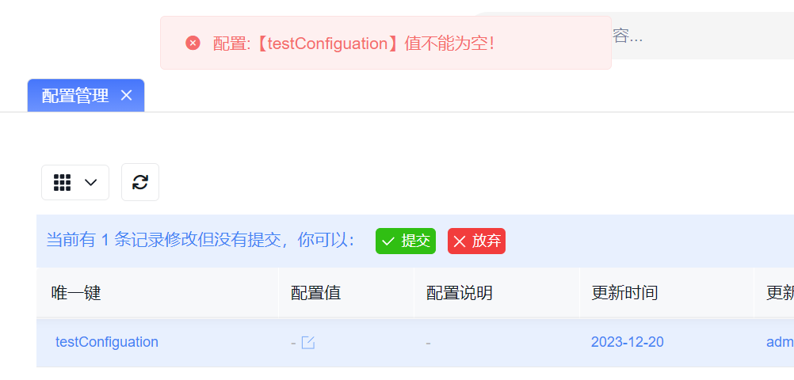
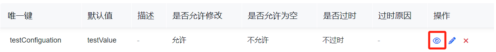
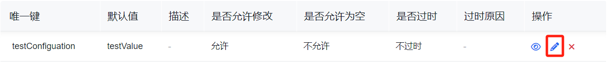
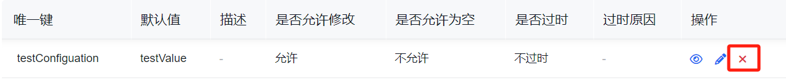

# 配置项

潮汐栈支持配置管理能力，可根据系统和用户需求定义定制化配置项。

配置项适合承接那些“需要部署后继续调整，但又不适合直接写死在代码里”的系统参数或业务开关。

如果你是沿着新的手册主线进入这里，建议先对照以下页面：

1. [低代码开发总览](../../../low-code/overview)
2. [从需求到交付](../../../low-code/from-requirement-to-delivery)

这页主要用于说明如何定义和维护配置项；如果你当前只是想把第一个业务功能跑通，可以先记住“哪些值值得抽成配置”，稍后再回来治理。

## 什么时候适合定义配置项

- 某个值在部署后仍然可能调整
- 同一个业务能力需要在不同环境下使用不同取值
- 某个开关、阈值或默认值不适合直接写死在模型或代码里

如果一个值不会变化，或者只在单一逻辑里临时使用，通常不需要单独建配置项。

## 常见任务

### 定义配置项

#### 元数据

| 属性         | 说明                                             |
| ------------ | ------------------------------------------------ |
| 唯一键       | 配置项的唯一标识 **不可重复**                    |
| 值类型       | 配置值类型 详见[值类型](#值类型)                 |
| 默认值       | 配置值默认值                                     |
| 描述         | 配置说明                                         |
| 是否允许修改 | 配置项部署后， [配置值是否允许修改](#配置值修改) |
| 是否允许为空 | 配置项部署后，[配置值是否允许为空](#配置值为空)  |
| 是否过时     | 配置项部署后，[配置项是否允许过时](#配置项过时)  |
| 过时原因     | 不推荐使用该配置项原因                           |

:::info
当 `是否过时` 设置为 `开` 时，`过时原因` 为必填项。
:::

#### 值类型

| 值      | 说明             |
| ------- | ---------------- |
| int     | 整数类型         |
| long    | 长整数类型       |
| float   | 单精度浮点数类型 |
| double  | 双精度浮点数类型 |
| boolean | 布尔类型         |
| string  | 字符串类型       |

#### 配置值修改 {#配置值修改}

| 值  | 说明                       |
| --- | -------------------------- |
| 开  | 表示部署后允许修改配置值   |
| 关  | 表示部署后不允许修改配置值 |

这个开关决定的是“上线后还能不能改值”，而不是“当前能不能创建配置项”。

- 定义了一个"testConfiguration"配置项，且`是否允许修改`开关设为`关`。

  

  在配置管理界面，配置值则不允许修改。

  

- 定义了一个"testConfiguration"配置项，且`是否允许修改`开关设为`开`。

  

  在配置管理界面，配置值则允许修改。
  

  在配置管理界面，可以继续编辑配置值，例如：
  

#### 配置值为空 {#配置值为空}

| 值  | 说明                                                           |
| --- | -------------------------------------------------------------- |
| 开  | 表示允许配置值设置为空值                                       |
| 关  | 表示配置时必须提供有效配置值，否则系统可能会报错或无法正常运行 |

这个开关主要用于约束运行时是否允许“空配置”进入系统。

上面例子中，将`是否允许为空`开关设为`关`，编辑配置值并设置为空，点击提交，系统会弹出配置值不能为空的提示，如下图。

#### 配置项过时 {#配置项过时}

| 值  | 说明                                                           |
| --- | -------------------------------------------------------------- |
| 开  | 表示该配置项已经不推荐使用，可能存在问题或被其他的配置项所取代 |
| 关  | 表示该配置项可以一直使用                                       |

### 查看、编辑和删除配置项

查看配置项详情时，页面结构通常与新建配置项时相近，适合核对元数据是否定义正确。

编辑时，重点关注唯一键、值类型和几个约束开关是否还符合当前使用场景。

删除前，建议先确认是否已有页面、脚本、流程或接口逻辑依赖该配置项。

### 使用配置项

配置项适合承接那些需要“部署后仍可调整，但又不适合直接写死在代码里”的系统参数。

常见使用方式包括：

- 在业务逻辑中读取某个开关、阈值或默认值
- 在不同环境下覆盖同一个配置项的实际值
- 配合页面、脚本或接口逻辑切换功能行为

使用前建议先明确三件事：

1. 这个值是否真的需要在部署后可改
2. 是否允许为空或允许后续修改
3. 是否已经有更新的配置项替代它

## 使用建议

- 优先把“唯一键、值类型、默认值”定义稳定，再考虑是否开放修改
- 会影响运行行为的配置项，建议配合环境管理和发布流程一起使用
- 如果配置已经不再推荐使用，及时标记“过时原因”，方便后续治理
