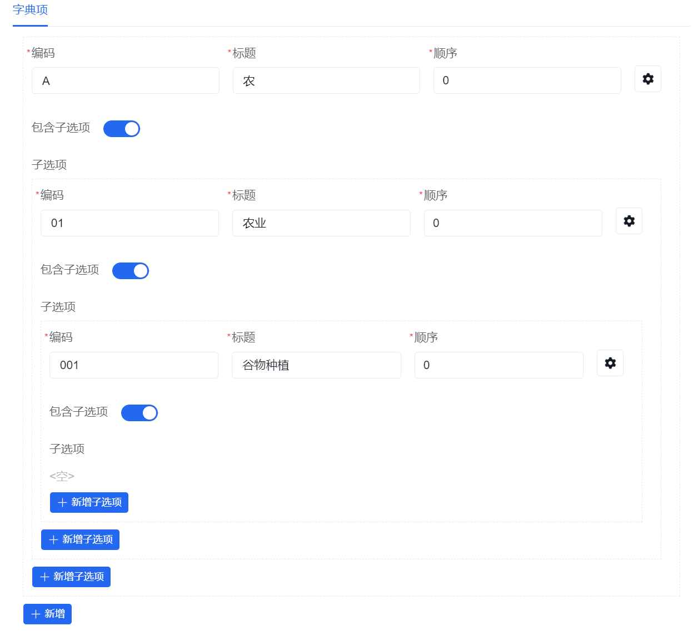
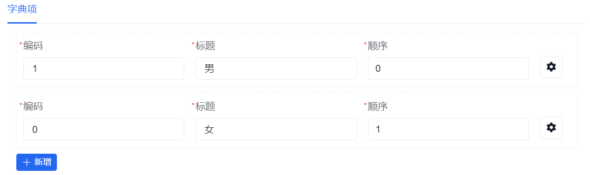
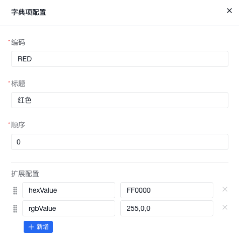
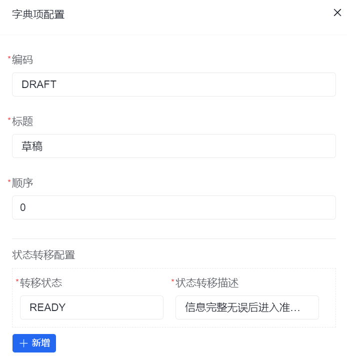
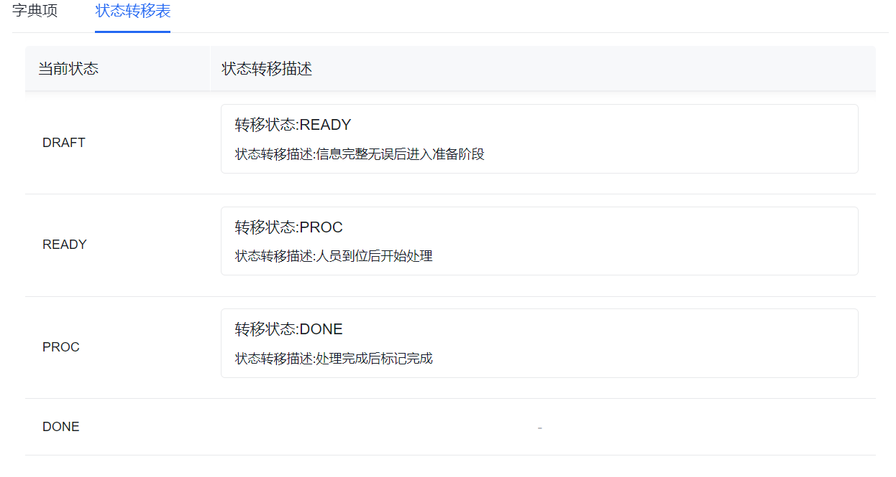
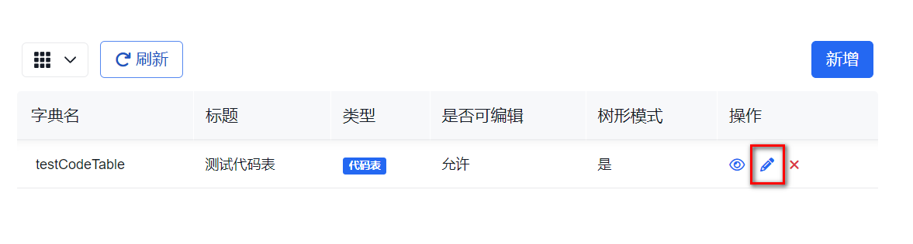
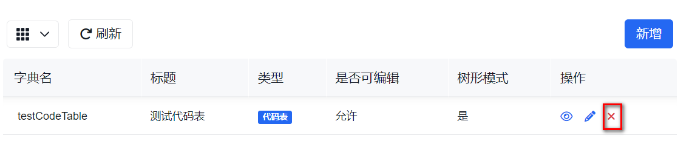
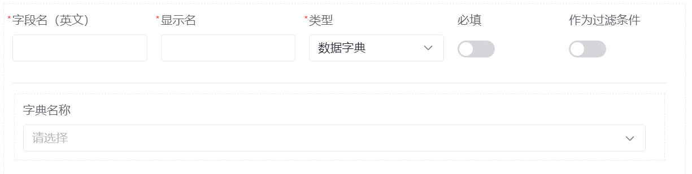

# 数据字典

数据字典用于定义业务模型中用到的引用数据，例如类别、地区、单位、货币、颜色等；数据字典能够随着应用迭代更新自动部署和更新到应用中，以便在应用中引用和使用。

如果你是沿着新的手册主线进入这里，建议先对照以下页面：

1. [低代码开发总览](../../../low-code/overview)
2. [业务模型](../business-model/)
3. [字段定义](../../../concepts/field-define/)

这页主要用于查数据字典本身及字典项的配置方式；当你已经明确哪些字段需要引用统一选项时，再回来读会更顺。

## 什么时候需要数据字典

- 多个模型、表单或流程需要复用同一组选项
- 选项值需要集中维护，而不是散落在页面配置里
- 你希望某类业务数据具备统一编码、显示名和排序规则

## 常见任务

### 定义字典

#### 字典属性

| 属性       | 说明                                                                                     |
| ---------- | ---------------------------------------------------------------------------------------- |
| 字典名     | 字典的唯一标识 **不可重复**                                                              |
| 字典标题   | 字典的显示名                                                                             |
| 字典类型   | 字典分类，详见 [字典类型](#字典类型)                                                     |
| 是否可编辑 | 字典部署后 [是否可编辑](#是否可编辑)                                                     |
| 树形模式   | 当字典类型为**代码表**时，是否启用树形的字典项。（枚举值和状态表类型的字典该属性不可用） |

树形模式示例如下：

当树形模式值为`开`，“农行分类”树形字典项:

当树形模式值为`关`，“性别”的字典项:

#### 字典类型

| 值     | 属性含义                                                                                                                                    |
| ------ | ------------------------------------------------------------------------------------------------------------------------------------------- |
| 代码表 | 代码表用于存储标准化的代码或分类信息，以便在系统中统一使用和管理，例如包含单位表、国家/地区表、分类、货币代码、海关代码、行业代码、民族等。 |
| 枚举值 | 枚举值用于定义一组常量，以便在系统中进行选择或分类，例如包含性别、颜色、大小等具有固定选项的属性。                                          |
| 状态表 | 状态表用于定义对象或实体的不同状态，以便在系统中追踪和管理其状态变化，例如包含订单状态、任务状态等。                                        |

#### 是否可编辑

| 值  | 含义                                                   |
| --- | ------------------------------------------------------ |
| 开  | 表示部署后允许修改字典项，可以新增、编辑和修改字典项， |
| 关  | 表示部署后当前字典不可修改和添加新字典项，只允许查看。 |

#### 字典项

| 属性名       | 属性含义                                                                                                                                                                                                 |
| ------------ | -------------------------------------------------------------------------------------------------------------------------------------------------------------------------------------------------------- |
| 编码         | 字典项编码，也是该字典项在当前字典中的唯一标识                                                                                                                                                           |
| 标题         | 系统显示名                                                                                                                                                                                               |
| 排序         | 字典项的顺序，升序                                                                                                                                                                                       |
| 扩展配置     | **代码表与枚举值属性**用于存储与字典项相关的其他属性或信息。                                                                                                                                             |
| 状态转移配置 | **状态表属性**当字典类型为状态表时，点击每一行字典项的扩展按钮，可以配置状态转移，包含以下属性：  1. 转移状态： 下一个字典项的唯一标识。   2. 状态转移描述：描述当前状态转移到下一个状态的条件。 |

扩展配置示例如下：

一个“颜色”字典，字典项即是不同的颜色，红色字典项可具有的以下属性：

#### 状态转移表

当字典类型为状态表时，可以为每个字典项（状态）配置状态转移信息：

在这里可以查看状态转移表：

### 查看、编辑和删除字典

查看字典详情时，通常会看到字典属性和字典项配置，适合核对当前字典的结构是否正确。

编辑时，重点关注字典类型、是否可编辑和字典项结构是否仍符合当前业务。

删除前，建议先确认当前字典是否已经被表单、模型字段或流程配置引用。

### 使用字典

可以通过数据字典对选项进行集中管理和维护，可以提高数据的一致性和准确性。

典型使用方式是：

1. 先定义好数据字典。
2. 在表单或模型字段里把字段类型设置为 `数据字典`，再选择对应字典名称。

## 使用建议

- 对于会在多个表单、模型或流程里复用的选项，优先放进数据字典统一维护
- 状态表适合承接“会流转的状态”，普通枚举值更适合承接固定选项
- 如果字段只是一次性的小范围选项，不一定需要单独抽成数据字典
