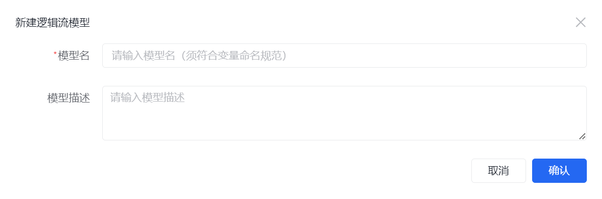
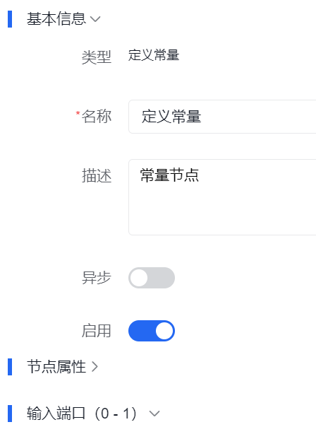
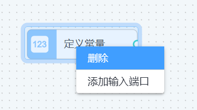
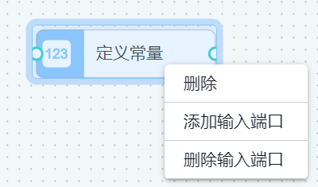
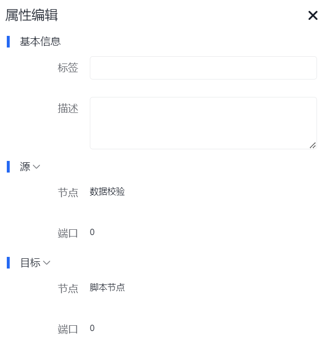
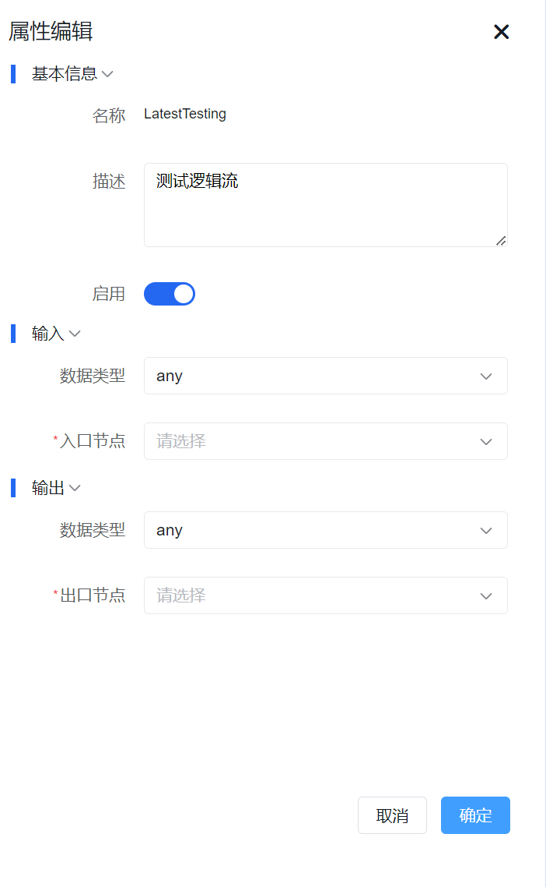
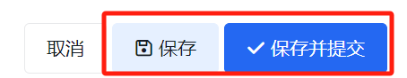
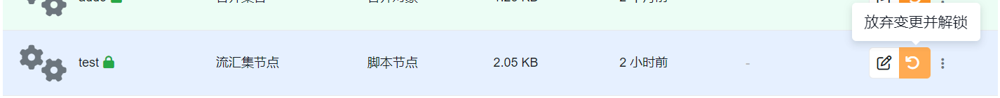
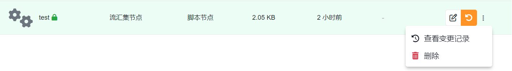

# 逻辑流

潮汐栈支持通过拖拽节点和连接来构建逻辑流，无需编写繁琐代码即可组织业务处理。它主要应用于请求响应模式的业务场景，特点是一次输入仅产生一次输出。

如果你是沿着新的手册主线进入这里，建议先对照以下页面：

1. [低代码开发总览](../../../low-code/overview)
2. [从需求到交付](../../../low-code/from-requirement-to-delivery)
3. [扩展逻辑流](../../advance/extend-backend/extend-logicflow/)

这页主要用于查逻辑流模型编辑器、节点配置和常见操作入口；当你已经明确要用逻辑流承接某段处理链时，再回来读会更顺。

## 你通常会在这里完成什么

- 创建逻辑流模型并定义输入输出
- 在编辑器里组织节点、连线和数据流转路径
- 为节点配置属性、输入端口、输出端口和运行方式
- 保存、回滚并查看逻辑流变更记录

## 常见任务

### 新建逻辑流模型

| 属性     | 必填 | 说明                          |
| -------- | ---- | ----------------------------- |
| 模型名   | 是   | 模型名 **合法的变量名且唯一** |
| 模型描述 | 否   | 模型描述                      |

:::warning
模型名创建后不支持修改。
:::

### 打开并编辑逻辑流

打开逻辑流后，会进入编辑器。编辑器通常由左侧 [节点库](#节点库)、中间 [画布](#画布) 和右侧抽屉式 [属性面板](#属性面板) 组成。

#### 节点库

节点库是搭建逻辑流的起点，你可以把节点拖入画布，再逐步把它们连成一条可执行的数据处理链。

##### 通用节点

| 节点类型                                | 说明                                                         |
| --------------------------------------- | ------------------------------------------------------------ |
|     | 提供一个常量输出值，通常用于为后续的计算或操作提供固定的输入 |
|   | 把一种数据结构映射成另一种数据结构，能够实现字段重命名       |
|    | 根据输入条件的不同，将流程分支到不同的路径                   |
|    | 执行脚本处理数据                                             |
|     | 接受多个输入，并将输入合并成一个对象                         |
|   | 接受 1 个输入，并向后传输                                    |
|    | 接受多个输入，并将数组合并成一个新的集合                     |
|      | 输入对象中提取指定的属性                                     |
|  | 输入对象中提取指定下标的元素                                 |
|  | 验证输入数据是否符合指定的规则或条件                         |
|      | 从输入对象中剔除指定的属性                                   |

##### 数据库操作节点

| 节点类型                                             | 说明                                                 |
| ---------------------------------------------------- | ---------------------------------------------------- |
|                 | 将传入节点的数据插入指定数据模型中                   |
|                 | 将传入节点的数据作为删除语句执行到指定数据模型中     |
|                 | 将传入节点的数据作为更新语句更新执行到指定数据模型中 |
|          | 将传入节点的数据作为部分更新语句执行到指定数据模型中 |
|                 | 将传入节点的数据作为搜索语句执行到指定数据模型中     |
|        | 将多条数据批量插入指定数据模型中                     |
|                  | 将传入节点的数据作为查询语句执行到指定数据模型中     |
|  | 将输入条件整理为统一的查询 DSL，便于后续节点复用     |
|             | 从指定数据模型中按条件获取单条记录                   |

:::info
不同版本的节点库可能略有差异，但通常都可以按“通用节点处理数据、数据库节点处理持久化”的思路来理解。
:::

#### 画布

画布是搭建和调整逻辑流结构的主要区域。你可以在这里连接节点、调整路径，并通过右键菜单处理节点和连线。

##### 右键菜单与输入端口

不同节点支持的输入端口数量不同，因此右键菜单里是否出现“添加输入端口”或“删除输入端口”，取决于该节点自身的端口规则。

上图中输入端口规则为 `(0-1)`，表示最少 0 个、最多 1 个输入端口。当前节点还没有输入端口时，右键菜单会出现“添加输入端口”：

添加完成后，右键菜单会改为显示“删除输入端口”：

当输入端口规则为 `(1-1)`，且节点已经存在 1 个输入端口时，右键菜单通常不会再显示添加输入端口的选项。

:::warning
右键菜单中是否可以添加或删除端口，取决于当前节点的输入端口配置和数量限制。
:::

#### 属性面板

右侧属性面板支持拖拽调整宽度。你选中的对象不同，面板里出现的配置项也不同：

- 选中**节点**时，会显示 [节点属性](#节点属性)
- 选中**节点间的连线**时，会显示 [连线属性](#连线属性)
- 选中**画布空白区域**时，会显示 [逻辑流属性](#逻辑流属性)

##### 节点属性

节点属性包含[基本信息](#基本信息)和[输入端口](#输入端口)、[输出端口](#输出端口)，以及节点的专有属性。

###### 基本信息

基本信息包括节点的名称、描述和其他相关信息。

| 属性 | 默认值 | 说明                                      |
| ---- | ------ | ----------------------------------------- |
| 类型 |        | 节点类型                                  |
| 名称 |        | 节点标识符 **唯一**                       |
| 描述 |        | 节点的详细说明                            |
| 异步 | `关`   | 是否以[异步方式](#异步方式) 执行          |
| 启用 | `开`   | 节点是否处于[节点启用状态](#节点启用状态) |

###### 异步方式

| 值  | 说明                   |
| --- | ---------------------- |
| 开  | 节点以异步方式执行     |
| 关  | 节点按当前流程正常执行 |

###### 节点启用状态

| 值  | 说明                                                 |
| --- | ---------------------------------------------------- |
| 开  | 节点参与流程执行，并纳入校验与运行                   |
| 关  | 节点不参与流程执行，通常也不会进入实际运行与校验链路 |

###### 输入端口

输入端口是节点接收数据的地方。一个节点可以拥有零个或多个输入端口。

| 属性     | 说明                   |
| -------- | ---------------------- |
| 端口名   | 标识端口的名称         |
| 数据类型 | 端口所处理的数据的类型 |
| 描述     | 对端口的详情描述       |

###### 输出端口

输出端口是节点向其他节点传递数据的地方。一个节点可以拥有一个或多个输出端口，属性结构与输入端口一致。

##### 连线属性

| 属性             | 说明                                           |
| ---------------- | ---------------------------------------------- |
| 标签             | 连线说明                                       |
| 描述             | 连线的详细说明                                 |
| 源节点           | 连线起始点的节点 **不支持修改**                |
| 源节点端口下标   | 源节点上与连线连接的端口的下标 **不支持修改**  |
| 目标节点         | 连线终点的节点 **不支持修改**                  |
| 目标节点端口下标 | 目标节点上与连线连接的端口的下标**不支持修改** |

##### 逻辑流属性

| 属性         | 默认值 | 说明                                            |
| ------------ | ------ | ----------------------------------------------- |
| 模型名       |        | 创建的逻辑名，不支持修改                        |
| 模型描述     |        | 模型描述                                        |
| 启用         | `开`   | 逻辑流是否处于[逻辑流启用状态](#逻辑流启用状态) |
| 输入数据类型 |        | 指定了输入节点提供的数据的类型                  |
| 输入节点     |        | 逻辑流接收数据的起点                            |
| 输出数据类型 |        | 指定了输出节点接收的数据的类型                  |
| 输出节点     |        | 逻辑流生成结果或传递数据的终点                  |

###### 逻辑流启用状态

| 值  | 说明             |
| --- | ---------------- |
| 开  | 逻辑流可以被执行 |
| 关  | 逻辑流暂停执行   |

### 保存、提交和回滚

逻辑流模型同样具备版本管理能力。编辑过程中可以先保存当前结果，提交后再查看变更记录。

提交后，可以查看逻辑流的[变更记录](#逻辑流变更记录)。

如果当前修改需要放弃，可以通过 `放弃变更并解锁` 回滚到上一次提交的版本。

### 删除逻辑流

删除前，建议先确认该逻辑流是否仍被业务模型操作、WebAPI 或其他配置引用。

### 查看变更记录 {#逻辑流变更记录}

:::info
如果当前环境没有展示完整的变更记录能力，请以实际版本和权限配置为准。
:::

## 常见用法

逻辑流最常见的使用方式有三类：

1. 作为业务模型某个操作的实现逻辑
2. 作为 [WebAPI 模型](/docs/concepts/webapi-model/) 的处理层
3. 在低代码场景中承担“查询、校验、分支、保存、返回结果”的完整处理链

如果你已经建好了业务模型，常见落地路径通常是：

1. 先明确输入数据和输出结果
2. 用通用节点完成映射、校验和分支判断
3. 用数据库节点读写数据模型
4. 需要复杂计算时再配合脚本、表达式或融合开发扩展

## 使用建议

- 第一次建逻辑流时，先做一个节点少、路径短的最小版本，更容易验证输入输出是否正确
- 先用通用节点把数据链路跑通，再逐步补数据库节点、脚本节点和复杂分支
- 如果逻辑已经明显超出可视化编排边界，可以结合 [融合开发](../../../fusion-development/) 一起处理
