# 消息通知

潮汐栈支持消息通知能力，可用于站内消息、微信、阿里云短信等多种通知方式。

如果你是沿着新的手册主线进入这里，建议先对照以下页面：

1. [低代码开发总览](../../../low-code/overview)
2. [审批流](../../module/approval-workflow/)
3. [消息中心页面](../../module/notification/)

这页主要用于查通知模板和渠道配置细节；当你已经明确“要发什么消息、发给谁、通过什么渠道发”之后，再回来读会更顺。

## 这页适合什么时候读

- 你已经确定业务里需要“发通知”这件事，但还没想清楚模板该怎么配
- 你已经知道要发哪个渠道，但不清楚某个字段具体是干什么的
- 你在排查“为什么有人没收到通知”，需要反查模板、载荷和地址来源

## 开始前先准备

在潮汐栈里，通知模板只是“发什么”和“怎么发”的定义，真正能不能发出去，还取决于接收方地址和外部渠道接入是否齐备。

常见的接收地址来源可以这样理解：

- 站内信：直接按员工发送，不依赖额外外部地址
- 邮箱：读取员工档案中的邮箱字段
- 阿里云短信 / 电话通知：读取员工档案中的手机号字段
- 微信 / 钉钉 / 极光推送：读取员工与对应渠道账号的映射地址，通常需要先维护员工渠道映射

如果员工缺少对应渠道地址，那么该员工即使被选为接收方，也不会通过该渠道收到消息。

## 什么时候需要通知模板

- 需要在审批、状态变更、任务处理或异常场景中主动通知相关人
- 同一类消息需要反复发送，适合沉淀成可复用模板
- 需要区分不同渠道的发送格式和触达方式

## 先理解通知模板的结构

一个通知模板通常由三部分组成：

1. 基本信息：模板名、模板标题、启用状态
2. 渠道配置：每个渠道各自的必填配置和可选配置
3. 载荷参数：发送时允许传入哪些动态字段

在运行时，渠道配置又分成两层：

- `schema`：渠道本身必需的内容，例如标题模板、内容模板，或第三方模板 ID
- `options`：渠道发送时的附加参数，例如跳转地址、终端、签名或推送高级选项

如果模板被关闭，运行时会直接跳过发送；如果载荷参数与模板声明不匹配，发送也会失败。

## 通知方式

不同渠道适合的场景并不一样，通常可以这样理解：

- 站内信：最适合系统内提醒、待办和跳转入口
- 微信 / 钉钉：适合需要触达业务人员的企业协同场景
- 邮箱：适合正式通知、外部协同或留痕
- 短信 / 电话：适合强提醒和高时效场景
- 推送类渠道：适合移动端消息触达

是否可选某个渠道，还取决于当前环境是否已经完成对应渠道的配置与接入。

### 站内信

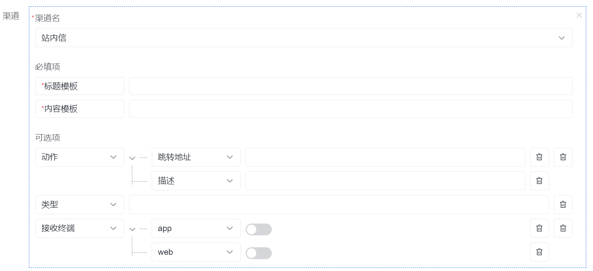

| 属性     | 必填 | 说明                                                              |
| -------- | ---- | ----------------------------------------------------------------- |
| 标题模板 | 是   | 站内信标题，支持使用载荷变量拼出动态标题                          |
| 内容模板 | 是   | 站内信正文内容，通常用于展示待办、结果通知或异常说明              |
| 动作     | 否   | 消息点击后的后续动作，通常用于跳转到业务页面，[查看具体动作配置](#动作) |
| 类型     | 否   | 消息的业务分类，适合区分审批消息、系统提醒、异常告警等类型        |
| 接收终端 | 否   | 指定消息在哪些终端展示，当前支持 `app` 和 `web`                   |

#### 动作

| 属性     | 说明                                             |
| -------- | ------------------------------------------------ |
| 跳转地址 | 配置点击消息后去往的具体页面地址                 |
| 描述     | 对跳转目标的补充说明，便于接收方理解进入哪个页面 |

例如：订单管理中推送消息通知，消息提示 xx 商品已发货，点击消息可查看具体商品物流信息，在`动作`处配置跳转地址为**商品物流信息详情地址**，可实现点击消息跳转至物流详情页。

#### 接收效果

站内信的接收效果可参考 [消息中心页面](../../module/notification/index.md#页面概览)。

### 微信

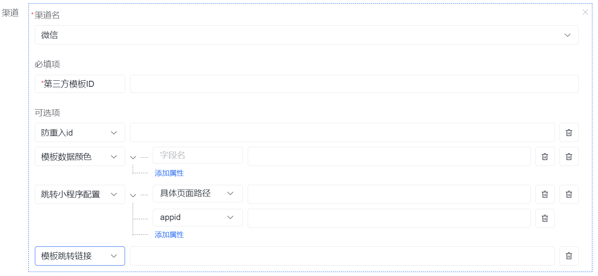

| 属性           | 必填 | 说明                                                                 |
| -------------- | ---- | -------------------------------------------------------------------- |
| 第三方模板 ID  | 是   | 对应微信侧的模板消息 ID，需要与微信公众平台或企业微信侧模板保持一致 |
| 防重入 id      | 否   | 同一接收方在短时间内的幂等标识；当同一个 `openid + clientMsgId` 重复发送时可用于防重 |
| 模板数据颜色   | 否   | 为模板中的载荷字段单独指定展示颜色，适合突出金额、状态、时间等重点信息 |
| 跳转小程序配置 | 否   | 配置小程序 `appid` 和页面路径，点击消息后跳到指定小程序页面          |
| 模板跳转链接   | 否   | 配置点击消息后的网页链接；是否生效还受微信账号类型和模板能力限制     |

实践上，一般在“小程序跳转”和“普通链接跳转”之间二选一，避免接收方点击后出现和预期不一致的落点。

### 钉钉

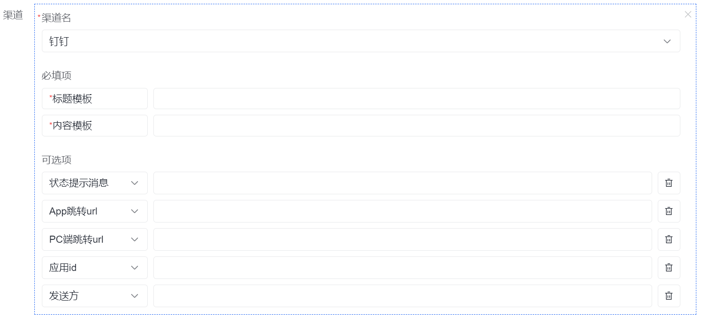

| 属性          | 必填 | 说明                                                         |
| ------------- | ---- | ------------------------------------------------------------ |
| 标题模板      | 是   | 钉钉 OA 消息卡片标题                                         |
| 内容模板      | 是   | 钉钉 OA 消息正文                                             |
| 状态提示信息  | 否   | 卡片顶部状态栏文案，适合显示“待处理”“已驳回”“已完成”等状态 |
| App 跳转 url  | 否   | 手机端打开消息时跳转的地址                                  |
| PC 端跳转 url | 否   | PC 端打开消息时跳转的地址                                    |
| 应用 id       | 否   | 钉钉企业应用的 `agentId`，用于指定由哪个应用发出消息         |
| 发送方        | 否   | OA 卡片中显示的发送方或作者名称                              |

如果要通过钉钉发给具体员工，通常还需要先把员工与钉钉账号做好映射。

### 邮箱

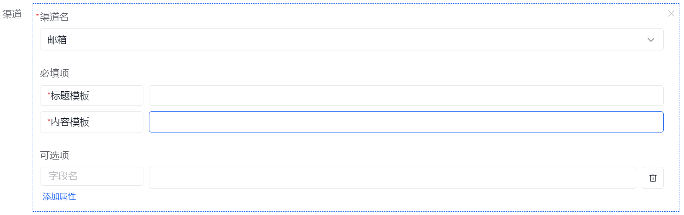

| 属性       | 必填 | 说明                                                         |
| ---------- | ---- | ------------------------------------------------------------ |
| 标题模板   | 是   | 邮件标题                                                     |
| 内容模板   | 是   | 邮件正文，运行时会按 HTML 邮件发送                           |
| 自定义属性 | 否   | 当前版本运行时代码没有额外邮件渠道选项，一般保持为空即可     |

邮件是否能真正发出，还取决于当前环境是否已经配置好邮件服务器、账号和授权信息。

### 极光推送

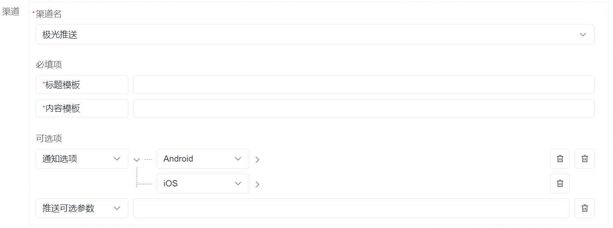

| 属性         | 必填 | 说明                                                                 |
| ------------ | ---- | -------------------------------------------------------------------- |
| 标题模板     | 是   | 推送通知标题                                                         |
| 内容模板     | 是   | 推送通知正文                                                         |
| 通知选项     | 否   | Android / iOS 平台下的通知展示细节，如标题覆盖、角标、声音、分类等 |
| 推送可选参数 | 否   | 极光推送 REST API 的高级选项；只有需要做平台级或时效级控制时再填     |

:::info
极光推送的可选字段较多，平台页面里以对象方式直接透传。第一次接入时，建议先只配置标题和内容，确实需要定制推送样式时再参考 [极光官方 REST API 文档](https://docs.jiguang.cn/jpush/server/push/rest_api_v3_push) 补充配置。
:::

### 阿里云-短信

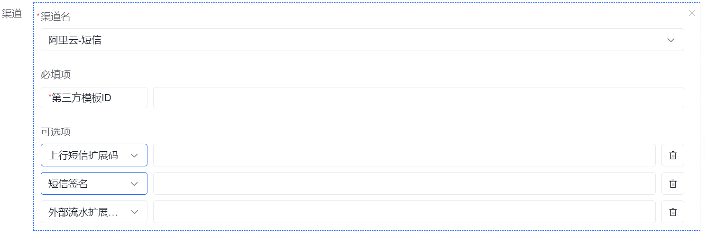

| 属性             | 必填 | 说明                                                                 |
| ---------------- | ---- | -------------------------------------------------------------------- |
| 第三方模板 ID    | 是   | 对应阿里云短信模板 ID                                                |
| 上行短信扩展码   | 否   | 需要接收用户回复短信时使用；普通通知短信通常可以留空                 |
| 短信签名         | 否   | 短信发送时使用的签名，需与阿里云侧已审核通过的签名一致               |
| 外部流水扩展字段 | 否   | 业务侧自定义流水号，适合做发送对账、回执关联或问题排查               |

短信是否发送成功，还依赖员工手机号是否完整，以及环境里是否完成阿里云短信账号配置。

### 阿里云-电话通知

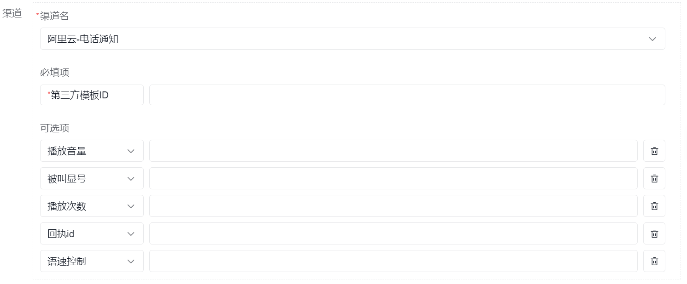

| 属性          | 必填 | 说明                                                         |
| ------------- | ---- | ------------------------------------------------------------ |
| 第三方模板 ID | 是   | 对应阿里云语音通知模板 ID                                    |
| 播放音量      | 否   | 语音播报音量，范围 `0-100`，代码默认值为 `100`               |
| 被叫显号      | 否   | 用户来电显示的号码                                           |
| 播放次数      | 否   | 同一段语音内容重复播放次数，范围 `1-3`，代码默认值为 `3`     |
| 回执 id       | 否   | 业务追踪标识，便于把阿里云回执和本次业务通知对应起来         |
| 语速控制      | 否   | 语音播放速度，范围 `-500~500`                                |

## 常见任务

### 定义通知模板

#### 模板属性

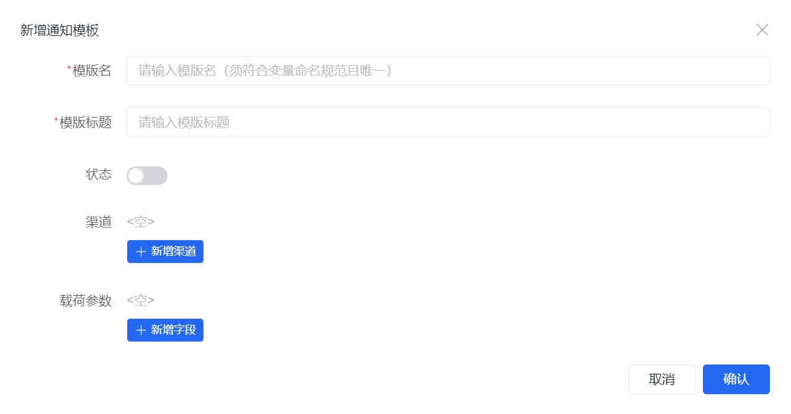

| 属性     | 必填 | 说明                                                                    |
| -------- | ---- | ----------------------------------------------------------------------- |
| 模板名   | 是   | 模板的唯一标识，需符合变量命名规范；后续在流程、脚本或代码中通常按这个名字引用 |
| 模板标题 | 是   | 模板在管理界面中的标题，便于管理员和实施人员识别                         |
| 状态     | 否   | 控制模板是否启用；关闭后即使业务调用该模板，也不会继续发送               |
| 渠道     | 否   | 当前模板允许使用哪些通知渠道，[查看具体通知方式](#通知方式)              |
| 载荷参数 | 否   | 发送通知时允许传入的动态数据，[查看具体配置](#载荷参数)                  |

创建模板时，建议优先把一个主渠道先跑通，再补其他渠道；这样排查问题时更容易定位是模板、地址还是外部渠道接入的问题。

#### 载荷参数

当发送消息通知时，如果需要把具体业务数据一并传递给接收方，就需要配置载荷参数来实现。运行时会按照这里定义的字段和类型校验实际发送入参，所以这里既是模板说明，也是发送约束。

例如：
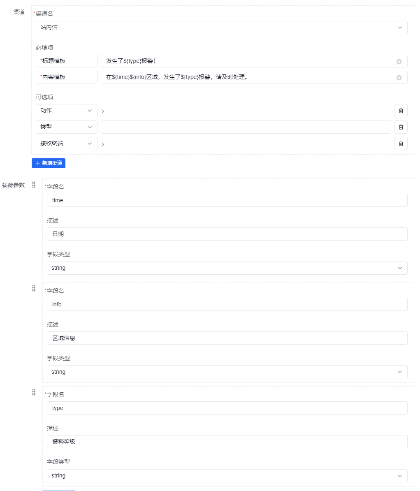

> 请注意： 在模板中载荷参数使用 **${}** 包裹字段名。

常见用法例如：

- `${applicantName}`：显示申请人
- `${orderNo}`：显示订单号
- `${approveTime}`：显示审批时间
- `${reason}`：显示驳回原因或异常说明

### 查看、编辑和删除模板

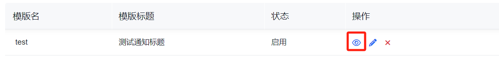

查看模板详情时，页面结构通常与创建模板时相近，适合核对渠道、载荷参数和模板内容是否符合预期。

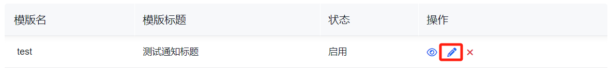

编辑模板时，通常重点关注模板变量、渠道选择和动作跳转是否还适配当前业务。

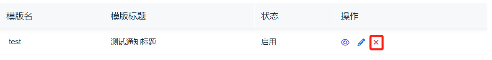

删除前，建议先确认当前模板是否仍被审批流、业务操作或其他通知节点引用。

### 使用通知模板

通知模板通常会在以下场景中被引用：

- 审批流节点通知
- 业务状态变更提醒
- 任务待办或异常告警
- 面向用户的站内信、短信或邮件触达

实践上建议先确定三件事：

1. 谁是接收方
2. 触发时机是什么
3. 消息发送后是否需要让用户跳转到某个具体页面

如果你已经确定了模板但通知仍没发出去，优先检查以下几项：

1. 模板是否处于启用状态
2. 发送时传入的载荷字段是否和模板声明一致
3. 接收员工是否具备该渠道所需地址
4. 当前环境是否已经接入并配置好该渠道
5. 模板中是否选中了正确的渠道和跳转配置

## 使用建议

- 先确定业务场景是否真的需要多渠道同时发送，再决定模板拆分方式
- 优先把站内信或一个主渠道先跑通，再逐步补短信、邮件或企业协同渠道
- 如果通知是审批、待办或异常处理的一部分，建议和对应业务流程一起联调
- 对接外部渠道时，先完成员工地址准备和环境配置，再开始模板联调，效率会高很多
